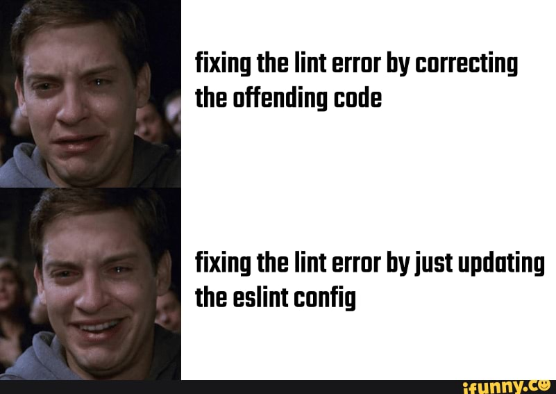
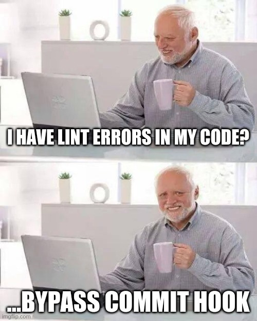
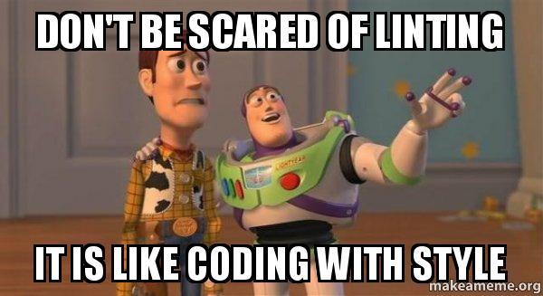

--- title
# golangci-lint
## Theelinger labert schon wieder?!
Nerzal · August 2023

--- blank
# WARUM TOBIAS?!
Beruhigt euch erst mal wieder <3

--- image

--- image

--- image

--- image

--- image
# Doch es hat Sinn

--- content
# Agenda

- Warum?
- Was kanner?
- Local Usage
- CI Einsatz

--- content
# Warum?

- Security
- Bug-Prevention
- Performance
- Clean Code
- Einheitlicher Coding Style
- Glücklicher Tobi Theel

--- blank
# Was kanner?
Mach mal Doku auf

--- blank
# Local Usage
Zeig mal.

--- mixed
# CI Einsatz

- Pipeline failen lassen
- Output sammeln und in StaticCodeAnalyzer-Tools-Dingens-Weißt-Schon füttern

Zeig mal.

--- blank
# Aber mein Projekt hat nun dreihundertachtundsechzigmillionenfünfhunderttausenddreiundsiebzig Linter Errors?!
Chill!

--- blank
# Pfadfinder Regel
Hinterlasse einen Platz immer sauberer, als du ihn vorgefunden hast. Unter die Pfadfinder-Regel fallen aber nur Dinge, die du in 5-10 Minuten aufgeräumt hast.
