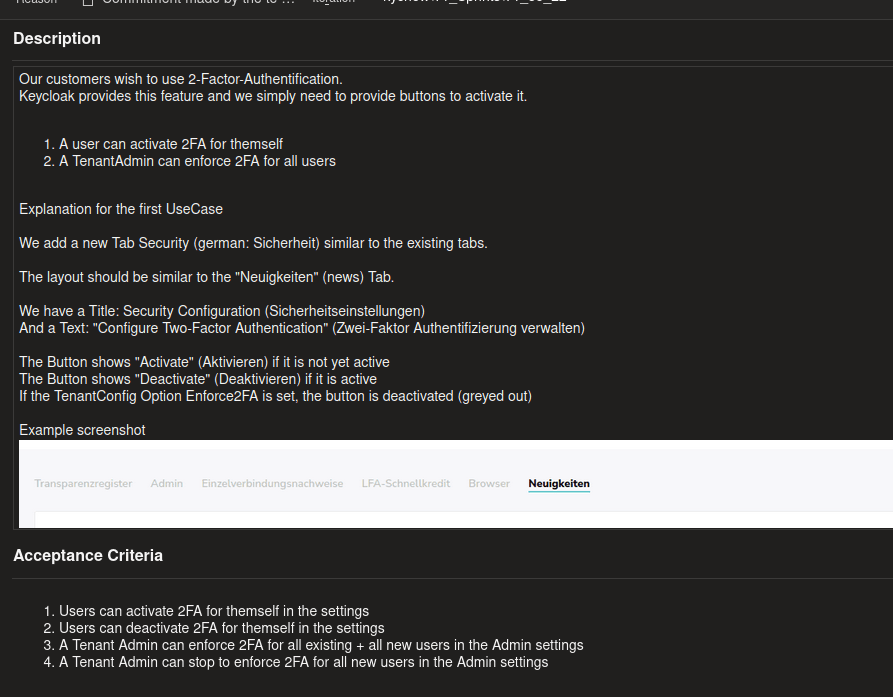
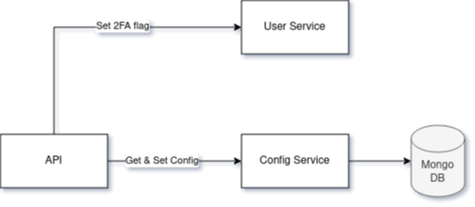
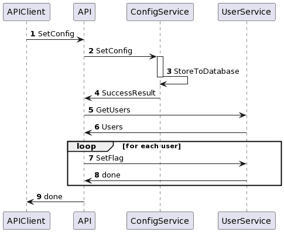

---
# How to Approach a Problem
## As a Dev
Tobias · August 2022

---

Image from Know Your Meme (https://i.kym-cdn.com/entries/icons/facebook/000/008/342/ihave.jpg)

---
# Introduction
In the life of a developer, especially at the beginning, we sometimes face tasks to solve and have no idea where to start. We have a huge wall in front of us and can't see what's behind it. I want to provide some methods that helped, and are still helping me, get over this wall.

---
# Agenda
- The Task
- Gain Knowledge
- The Writer
- The Artist
- Pair- and Mob-Programming
- Open Discussion

---
# The Task

Screenshot of a product backlog item

--- mixed
# So What Do We Have to Do?
For our case, we concentrate on the tenant configuration setting.

- We must provide a possibility to set the configuration
- We must provide the possibility to get the configuration
- When setting configuration, all users must get a flag that tells the user service they have to set 2FA in order to proceed with login

--- mixed
# Gain Knowledge
Do I know all components that are affected?

- You might have to touch several services
- In a monolith, you might have to touch several packages

--- mixed
# Gain Knowledge, Part 2
Have I or my team solved a similar problem in the past?

- Helps identifying pitfalls
- Gain free and fast knowledge
- You might get a blueprint on how to solve the problem

--- mixed
# Gain Knowledge, Part 3
Is my understanding of all affected technologies good enough to solve the issue?

- Enables you to do research on technologies
- Identifies possible pitfalls

--- mixed
# The Writer
The writer writes down the steps needed to solve an issue. This can be done in many ways. Examples:

- Write a list of steps in each function
- Write a general todo list
- Paraphrase the complete problem in your own language

---
# Example
```go
func UpdateConfig(option ConfigOption) error {
	// 1. Send request to config service
	// 2. Get all users
	// 3. Set 2FA flag on each user
	return nil
}
```

--- mixed
# The Artist
The artist visualizes the problem. This can be done with simple graphics made of rectangles and lines, in the form of UML diagrams, or whatever way of visualizing the problem helps. Examples:

- Create a very basic image that contains all affected components
- Create a UML sequence diagram

---
# Example

Simple diagram of the affected components

---
# Example

Simple sequence diagram

---
# Helpful Tools
- draw.io
- plantUML

---
# Pair- and Mob-Programming
Multiple developer brains tend to be very effective in finding good solutions.

---
# Open Discussion
What ways of approaching problems do you have?
