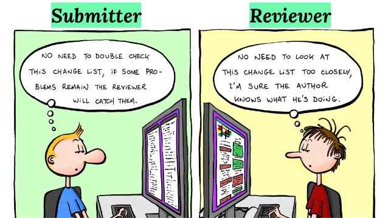

--- title
# How to Code Review
## How to Do It Properly!
Nerzal · March 2021

--- content
# Why Code Reviews?
- Ensure requirements are met
- Find defects
- Ensure code quality
- Share knowledge

--- image

Code Quality (imgflip.com)

--- content
# Forget Your Ego!
- Everyone makes mistakes!
- You are NOT your code!
- In tech, everyone is continuously learning!
- There is no such thing as a "small change"!
- I don't care how senior you are!

--- image
# Did Not See That Coming?!

You didn't see that coming (imgflip.com)

--- image
# Code Reviews

Merge request (imagemag.ru)

--- content
# Agenda
- Prerequisite
- Starting Point
- Dive deep
- Tooling
- Issues
- Code Quality
- How to Not

--- blank
# Prerequisite
Before one or multiple reviewers can actively check the code, the author needs to make sure that the change is reviewable. For a change to be reviewed under perfect conditions, it should not be bigger than 200-400 LOC (study results from SmartBear). They revealed that a review of 200-400 LOC within a 60 to 90 minute timeframe should discover 70-90% of the defects.

--- image

Defect Density vs LOC (smartbear.com)

--- blank
# Be Descriptive
Your pull request should be as descriptive as possible. Link the tickets that the PR solves and include the essence of your change in the description.

--- blank
# Take Your Time
Take your time, do not rush things! A carefully performed review saves a lot of time and money! Example: fixing a bug in production costs 250€. Fixing the same bug within a review process costs 20€. (Costs may vary, just wanted to make a point.)

--- mixed
# Have a Checklist
Checklists can help greatly improve the output of code reviews. I'd say it's best practice to have standard checklists for your team.

Example:

- Acceptance criteria are met
- Change is covered by tests
- Tests are green / change has been tested by the reviewer
- Errors and exceptions are handled correctly
- No violations of the coding guidelines
- No violations of the logging guidelines
- No potential security issue found
- (Author) Alcohol level is low enough

--- mixed
# Starting Point
What is most important when reviewing a change?

The change must reflect the requirements and meet the acceptance criteria. So you have to:

- Check requirements
- Check if requirements are fulfilled

--- blank
# Make Sure the Code Actually Runs
The code looks like it really implements all requirements. Nice! Now we have to make sure that the code actually builds and runs. In the best case we have tests that automatically run when a PR is submitted — if the tests cover all requirements, this step is more or less done already. If that's not the case, you have to check out the code and try the change yourself!

--- mixed
# Dive Deep
Do not just scratch the surface! It is mandatory for you as a reviewer to understand the following:

- What exactly is happening
- Why is it happening

In order to really find issues, you need to develop the same understanding of the change as the author of the change.

If the code is hard to understand, you found an issue! Talk to the author, ask questions, maybe also set up a meeting.

--- mixed
# Quality #1
At the end of the day the goal is to have code that is:

- Easy to read
- Easy to maintain

--- blank
# Still Hard to Understand?
The code is now clean and easy to read, but you're still not able to understand it entirely? Get help — grab another person to review the code. Sometimes it's important to understand the business case to be able to understand the code. Let the product owner educate you!

--- mixed
# Tooling
Make use of tools to help you review the code.

Example: Azure DevOps provides a wide range of features that help you out. You can:

- Mark files as checked
- File suggestions for a change
- Link tickets and mention other branches etc.
- Discuss issues using the comments

--- mixed
# Automate All the Things
Make use of policies to automate the process.

Examples:

- Add reviewers
- Enforce at least 2 approvals for a review
- Reset approvals on changes
- Run linting
- Run testing
- Run static code analysis and annotate issues in the PR
- Run Nancy etc.

--- mixed
# Issues
Here are some rules for how to handle issues:

- Be nice
- Be helpful
- Make suggestions
- Ask questions

--- mixed
# Not Every Issue Is a Showstopper
Some things do not have to be fixed immediately.

- Find minor issues
- Create a ticket
- Resolve the comment

--- mixed
# Code Quality
Code quality is important, but not the most important topic here.

Bad architecture and bad design always lead to problems. Architecture and design choices should be documented somewhere — the documentation of design choices fits nicely in the tickets.

So what can we check in terms of architecture and design?

- Does the change match the planned architecture?
- Does the change match the planned design?

If not, raise a comment and point out where the architecture/design has been violated. There can be good reasons to violate them.

--- mixed
# Quick Fixes
Some quality issues can be easily addressed and fixed. This should be done before merging the PR.

Here are some examples of easy quick fixes:

- Function or class has too many LOC
- Violation of the IoC principle
- Violation of IOSP (Integration Operation Segregation Principle)

--- image
# How to Not

Code Quality (xkcd.com)

--- blank
# The "Linter"
You are NOT a linter! Do not comment on 200 lines that there is going to be a linter warning. Instead, file a single comment that explains the what and why, and tell the author to check the linter results again.

--- blank
# The "Formatter"
You are NOT a code formatting algorithm. Do not comment on 1337 lines that the formatting is off. Instead, tell the author to run a code formatting tool — everyone should have one configured (IDE, gofmt, etc.).

--- image

Code Formatting (blog.spreendigital.de)

--- blank
# The "LGTM"
Do not instantly approve that stuff! Instead, dive deep into the changes, understand them, and only approve if you are really sure!

--- image

LGTM (memegenerator.net)

--- blank
# The "Blocker"
Do not block changes forever! Instead, discuss issues and create tickets if the issues are not showstoppers — things can be fixed later.

--- image

You get a blocker (memegenerator.net)

--- blank
# The "Not My Problem"
Every change is important! If you see any issue, address it — don't just approve because you don't care! You are actively harming the codebase! Instead, address every issue you can find!

--- image

Not my problem (imgflip.com)

--- blank
# The Bad "Teacher"
If you find an issue and you already know how to solve it, just tell everyone! Don't leave the author in a state where they need to find the solution you already know.
