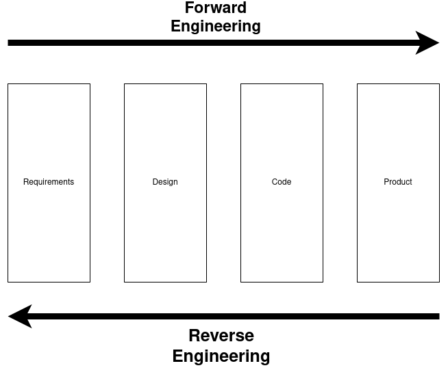
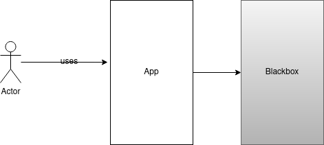
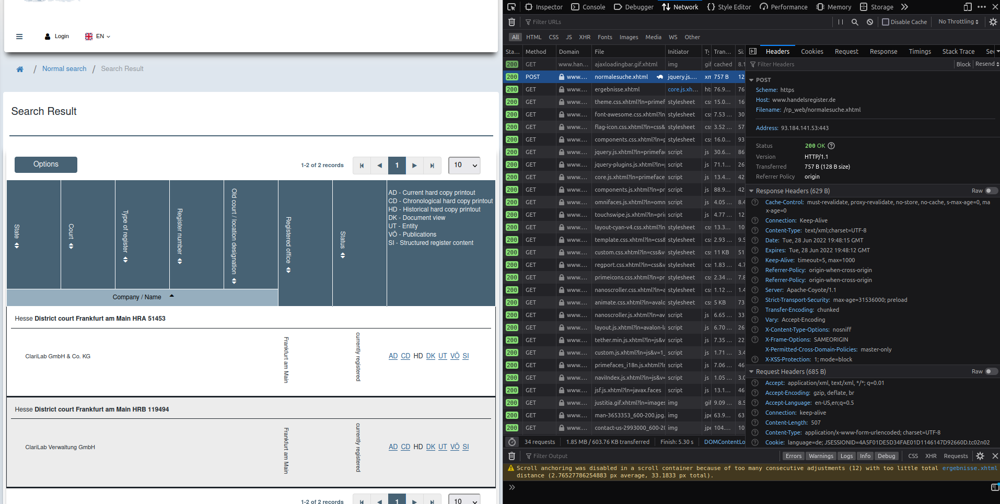
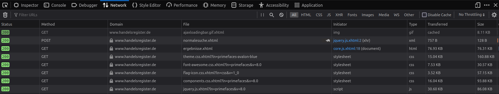
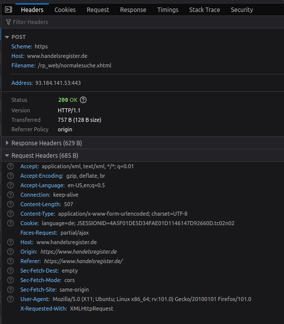
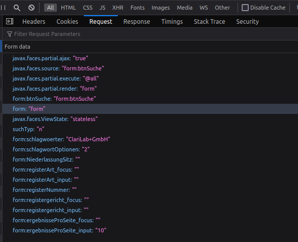
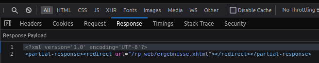
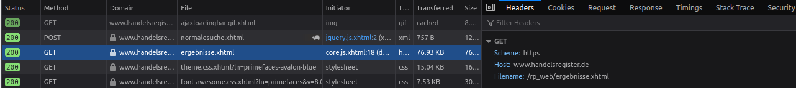
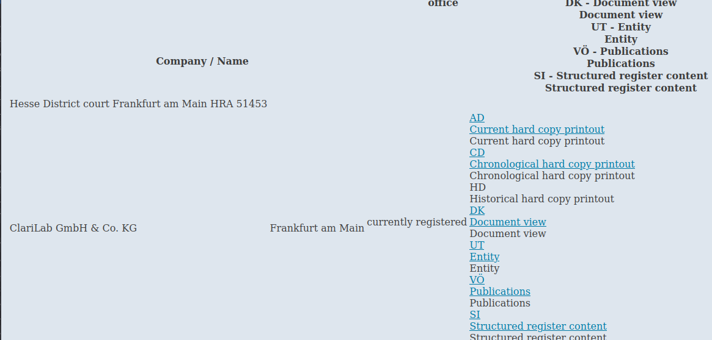

--- title
# How to Reverse Engineer
## Web Applications
Tobias · June 2022

--- content
# Why Reverse Engineer?
- Gain knowledge about an unknown system
- Port software to other platforms
- Write APIs for web applications that only provide a frontend

--- image
# What Is Reverse Engineering?

Reverse Engineering by Theelinger

--- content
# What's That Thingy You Guys Did With Those Third-Party Apps?
- In web apps, the frontend code is often a white box, since the JS code is downloaded
- It's easy to gain knowledge in such an environment

--- image

Reverse Engineer WebApp by Theelinger

--- content
# What Tools Can We Use?
- Browser DevTools
- curl
- API testers (Insomnia, Postman, etc.)

--- image
# DevTools

Screenshot of a search request in the German Traderegister

--- content
# Network Tab
- Lists all requests from browser to server
- Shows the used HTTP method
- Shows the used URL
- Shows the response type

--- image

Screenshot of the network tab in the German Traderegister

--- content
# Learnings: Network Tab
- Search uses a POST request
- The web app uses XHTML
- The search endpoint is /rp_web/normalesuche.xhtml

--- content
# Headers
- Select a request to get more details

--- image

Screenshot of the headers in the German Traderegister

--- content
# Learnings: Headers
- We send cookie data in the header
- The server is written in Java
- We need to take care of the session management

--- content
# Request
- The request tab shows the payload

--- image

Screenshot of request body in the German Traderegister

--- content
# Learnings: Request
- Payload as form-data
- Looks like we can talk directly to the API

--- content
# Response
- The request tab shows the payload

--- image

Screenshot of response body in the German Traderegister

--- content
# Learnings: Response
- The app works with partial responses
- It tells us the next page URL to fetch

--- image
# Fetch Search Results

Screenshot of search result in the German Traderegister

--- image
# Search Results Response

Screenshot of search result in the German Traderegister

--- mixed
# The HTML Tells Stories
- ids
- a-tag

```html
<a class="dokumentList" href="#" id="ergebnissForm:selectedSuchErgebnisFormTable:0:j_idt185:0:fade" onclick="mojarra.jsfcljs(document.getElementById('ergebnissForm'),{'ergebnissForm:selectedSuchErgebnisFormTable:0:j_idt185:0:fade':'ergebnissForm:selectedSuchErgebnisFormTable:0:j_idt185:0:fade'},'');return false">
    <span class="underlinedText" id="ergebnissForm:selectedSuchErgebnisFormTable:0:j_idt185:0:popupLink">AD</span>
    <div class="ui-tooltip ui-widget ui-tooltip-top" id="ergebnissForm:selectedSuchErgebnisFormTable:0:j_idt185:0:toolTipFade" role="tooltip">
        <div class="ui-tooltip-arrow" />
        <div class="ui-tooltip-text ui-shadow ui-corner-all">Current hard copy printout</div>
    </div>
    <script id="ergebnissForm:selectedSuchErgebnisFormTable:0:j_idt185:0:toolTipFade_s" type="text/javascript">
        $(function() {
            PrimeFaces.cw(" Tooltip ", " widget_ergebnissForm_selectedSuchErgebnisFormTable_0_j_idt185_0_toolTipFade ", {
                id: "ergebnissForm: selectedSuchErgebnisFormTable: 0: j_idt185: 0: toolTipFade ",
                showEffect: "fade ",
                hideEffect: "fade ",
                target: "ergebnissForm: selectedSuchErgebnisFormTable: 0: j_idt185: 0: fade ",
                position: "top "
            });
        });
    </script>
</a>
```

--- content
# How to Find the Interesting Bits in the HTML?
- HTML uses mostly XML-type syntax
- Using X-Path (the path to an element inside the HTML tree)
- Walk the complete tree to find your element
- Parse it with an XML parser

--- mixed
# Read HTML as XML
- etree is a powerful XML parsing and building library
- Generate a new XML doc from HTML bytes

```go
doc := etree.NewDocument()

err = doc.ReadFromBytes(html)
if err != nil {
	err = errors.Wrap(err, errMessage)

	return
}
```

--- code
# Use X-Path to Find Objects
```go
elements := doc.FindElements("//a[@class='dokumentList']")
for i := range elements {
	element := elements[i]
	childElements := element.ChildElements()

	if len(childElements) == 0 {
		continue
	}

	child := childElements[0]

	switch child.Text() {
	case "AD":
		adActionID = element.SelectAttr("id").Value
	case "CD":
		chronoActionID = element.SelectAttr("id").Value
	case "HD":
		historicalActionID = element.SelectAttr("id").Value
	case "DK":
		dkActionID = element.SelectAttr("id").Value
	case "UT":
	case "VÖ":
	case "SI":
	}
}
```

--- content
# Important Info Isn't Shown in the HTML?
- If you are unlucky, you might run into web apps that dynamically generate most of the content
- Happens when using an API tester, curl, or firing HTTP requests using a programming language
- Reason: JavaScript needs to run to build the page
- Solution: start a headless browser that renders the page and fetch the contents

--- content
# General Tips
- Delete the history in the network tab before you try a new action
- Check what cookies are being set
- Check request and response headers
- Try and error
- Every little detail can be important
- Often lots of parameters aren't required

--- content
# General Tips #2
- Understand how authentication works
- Understand how session handling works
- Try out every single feature with multiple parameters
- Take notes
- Developers often use open source code — you'll find hints to the libraries used in the code, headers, query parameters, cookies, etc. Google them

--- content
# General Tips #3
- Learn the basics of HTML
- Learn HTTP basics (methods, payload types, etc.)
- Gain a basic understanding of JS
- Try things even if they feel like absolute nonsense

--- content
# What Can I Do to Reverse Engineer an API of a Program Installed on My System?
- Monitor the packages on your network adaptor
- WireShark is a great tool
- Decompiling the code can help
