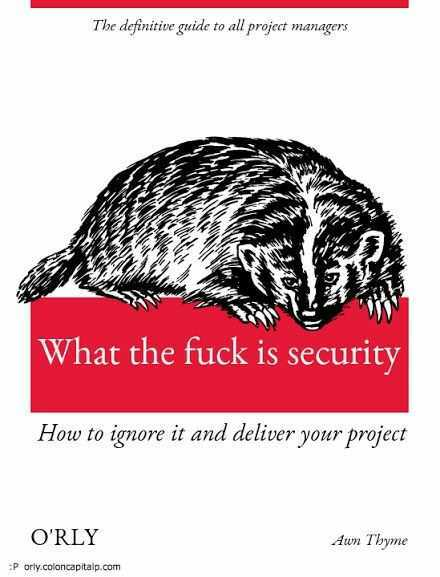
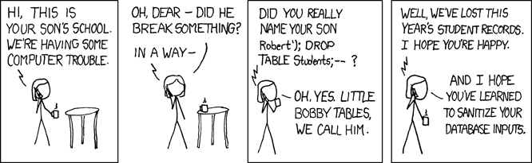

---
# MITRE 2021 Top 25 CWE
## You Should Be Aware of These
Nerzal · October 2021

---

Source: twitter (https://twitter.com/z3r0trust/status/1453180840091926532)

---
# What?
- Top 25 CWE (Common Weakness Enumeration)
- They have a list at cwe.mitre.org/top25/archive/2021/2021_cwe_top25.html

--- mixed
# 1. CWE-787: Out-of-Bounds Write
```go
package main

func main() {
	slice := make([]int, 3)

	slice[0] = 1
	slice[1] = 2
	slice[2] = 3
	slice[3] = 4
}
```

In many languages this is only an annoying bug. It's a bigger problem in C/C++, where it leads to unpredictable behavior.

--- mixed
# 2. CWE-79: Improper Neutralization of Input During Web Page Generation (Cross-Site Scripting)
```php
$username = $_GET['username'];
echo '<div class="header"> Welcome, ' . $username . '</div>';
```

We could now insert any function we want into the parameter. Yep, that's dangerous.

Mainly targets scripting languages — the kind of thing you find on the web.

Why scripting languages? They don't need to be compiled and can be executed directly. So validate and clean up your input!

--- mixed
# 3. CWE-125: Out-of-Bounds Read
```go
package main

func main() {
	slice := make([]int, 3)

	slice[0] = 1
	slice[1] = 2
	slice[2] = 3

	println(slice[4])
}
```

Only an annoying bug in most languages.

How could this be a problem? Imagine no exception is thrown, and the program just reads whatever it finds at that address in RAM. That could be your password.

--- mixed
# 4. CWE-20: Improper Input Validation
```go
package main

import "errors"

const price = 100

func main() {
	chargeUserAccount(10)
}

func chargeUserAccount(amount int) error {
	if amount > 100000 {
		return errors.New("what are u doin?!")
	}

	value := amount * price
	println("user is charged:", value, "€")
	return nil
}
```

Validate your inputs carefully!

Use fuzzing!

--- mixed
# 5. CWE-78: Improper Neutralization of Special Elements Used in an OS Command (OS Command Injection)
```php
$userName = $_POST["user"];
$command = 'ls -l /home/' . $userName;
system($command);
```

What could possibly go wrong with OS commands? How about an input like: ; rm -rf

Validate your inputs and neutralize dangerous input!

---
# 6. CWE-89: Improper Neutralization of Special Elements Used in an SQL Command (SQL Injection)

XKCD Comic — Exploits of a Mom (https://xkcd.com/327/)

---
# 7. CWE-416: Use After Free
Referencing memory after it has been freed can cause a program to crash, use unexpected values, or execute code. Source: cwe.mitre.org/data/definitions/416.html. No problem in Java, C#, Go, etc. Could be a big problem in C, C+, C++ (all puns intended).

---
# 8. CWE-22: Improper Limitation of a Pathname to a Restricted Directory (Path Traversal)
```go
package main

func main() {
	result := loadFromPath("cats")
	println(result)
}

func loadFromPath(path string) string {
	lookupPath := "/www/website/" + path

	switch lookupPath {
	case "/www/website/cats":
		return "funny-cat.jpg" // imagine this being a io read call to the hdd
	case "/www/website/dogs":
		return "funny-fog.jpg"
	case "/www/website/secret":
		return "mySecretDatabasePasswort1234!"
	default:
		return ""
	}
}
```

--- mixed
# 9. CWE-352: Cross-Site Request Forgery (CSRF)
"The web application does not, or cannot, sufficiently verify whether a well-formed, valid, consistent request was intentionally provided by the user who submitted it." Source: cwe.mitre.org/data/definitions/352.html

- Your server gets a request
- You validate the access token. Nice!
- ...
- You file a data breach report with your InfoSec team.
- Oops?!

What happened? A third party used the client's browser to forge a request. Please see the source linked above for possible mitigation tactics.

--- mixed
# 10. CWE-434: Unrestricted Upload of File with Dangerous Type
- You allow file uploads
- A nice dude uploads superhack.php
- ...
- You file a security incident report to your InfoSec team.

Restrict the file types you accept. You have a PDF upload? Good — then only accept PDFs!

--- mixed
# 11. CWE-306: Missing Authentication for Critical Function
- You have an API that handles bank accounts
- You have no authentication
- ...
- You file a security incident report to your InfoSec team.

There is no reason to not have authentication for your critical data and functions!

---
# 12. CWE-190: Integer Overflow or Wraparound
```go
package main

var accountBalance int32 = 2147483647

func main() {
	println("current account balance:", accountBalance)
}
```

- Not nice, easy to find
- Use proper data types
- Or Elon Musk calls your support and asks why the heck his account balance is negative?!

--- mixed
# 13. CWE-502: Deserialization of Untrusted Data
- You get an auth token
- You deserialize the auth token
- ...
- You file a security incident report to your InfoSec team.

What the heck happened?! We used a scripting language, and the auth token contained code from an attacker.

Now we're using Python and pickle to deserialize things. The code tells pickle to spawn a new process, and well — the code has fun on our system.

How to avoid it? Check best practices for your programming language.

--- mixed
# 14. CWE-287: Improper Authentication
- You get a request
- You authenticate the user and set cookies
- ...
- You file a security incident report to your InfoSec team.

Wait?! What?! Why?

- You check for cookies
- The attacker has set the isAdministrator cookie themself
- ...
- The attacker administrates your application

---
# 14. What Can We Do?!
Do not implement auth mechanisms yourself. (Also, please do not implement crypto logic yourself.) Just use Keycloak or a similar service, and use standard auth flows like OAuth2.

---
# 15. CWE-476: NULL Pointer Dereference
```go
package main

type CoolData struct {
	CoolProperty int
}

func main() {
	var data *CoolData

	println(data.CoolProperty)
}
```

What can we do?

- Unit tests
- Integration tests
- System tests
- E2E tests

---
# 16. CWE-798: Use of Hard-Coded Credentials
What shall I explain here? Do NOT hardcode credentials! How to prevent it? Use linters, static code analysis tools, proper code review, etc.

--- mixed
# 17. CWE-119: Improper Restriction of Operations within the Bounds of a Memory Buffer
The software performs operations on a memory buffer, but it can read from or write to a memory location outside the buffer's intended boundary. Source: cwe.mitre.org/data/definitions/119.html

Where is that dangerous?

- C
- C++
- Assembly
- Other languages

---
# 17. How?
You have a buffer, you get user input, the buffer overflows, and then you could overwrite critical data in RAM.

--- mixed
# 18. CWE-862: Missing Authorization
- User authenticates
- User accesses resources
- ...
- You file a security incident report to your InfoSec team.

Why? You didn't validate the user's permissions when they accessed resources they shouldn't have had access to.

---
# 19. CWE-276: Incorrect Default Permissions
During installation, installed file permissions are set to allow anyone to modify those files. Source: cwe.mitre.org/data/definitions/276.html. This is also a problem when setting up Docker containers where the user has too many privileges.

--- mixed
# 20. CWE-200: Exposure of Sensitive Information to an Unauthorized Actor
The product exposes sensitive information to an actor that is not explicitly authorized to have access to it. Source: cwe.mitre.org/data/definitions/200.html

What? The list of ways to expose data accidentally is long.

- You log too much information
- You have an unsecured request route
- You leak sensitive data in a response (internal program state, OS, installed packages)
- Code gets leaked
- etc.

--- mixed
# 21. CWE-522: Insufficiently Protected Credentials
The product transmits or stores authentication credentials using an insecure method that's susceptible to unauthorized interception and/or retrieval. Source: cwe.mitre.org/data/definitions/522.html

- User changes password
- ...
- You file a security incident report to your InfoSec team.

Why? You didn't check that the user changing the password was actually that user.

---
# 21. More Problems?
- You transmit user credentials via HTTP?!
- You store user credentials in clear text
- You store your own credentials for third-party services in clear text

--- mixed
# 22. CWE-732: Incorrect Permission Assignment for Critical Resource
- User makes a request
- ...
- You file a security incident report to your InfoSec team.

Why? You forgot to check the user's permission to do so.

---
# 22. What Else?
You created a file with incorrect permissions, for example 777.

--- mixed
# 23. CWE-611: Improper Restriction of XML External Entity Reference
The software processes an XML document that can contain XML entities with URIs resolving to documents outside the intended sphere of control, causing the product to embed incorrect documents into its output. Source: cwe.mitre.org/data/definitions/611.html

What? In simple words: XML documents can specify that external resources should be loaded into the document.

You could put common paths to credentials into the document.

---
# 23. How to Prevent It?
Deactivate XML external entity references in your XML parser.

--- mixed
# 24. CWE-918: Server-Side Request Forgery (SSRF)
- You accept a request that contains a URL you fetch data from
- ...
- You file a security incident report to your InfoSec team.

What? The attacker used your API as a proxy to resources that could be behind firewalls, etc. It could also be used to port-scan, etc.

---
# 24. How to Prevent It?
- Don't do such things? :)
- Don't let the consumer specify the port
- Validate the URL, maybe also blacklist URLs

--- mixed
# 25. CWE-77: Improper Neutralization of Special Elements Used in a Command (Command Injection)
- You accept a request and run a command on your system based on the input
- ...
- You file a security incident report to your InfoSec team.

Why?

- You have not neutralized special elements in a command

This works similar to SQL injection.
