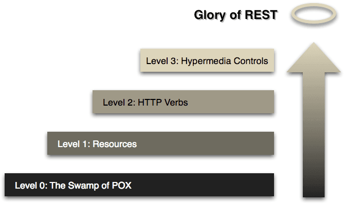
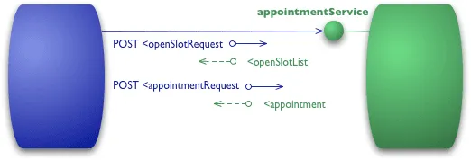
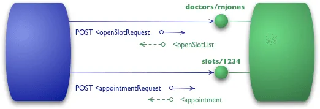
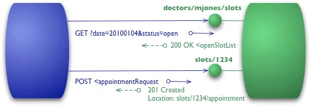

---
# REST API Design
## Tobi hat nen Buch gelesen
Nerzal · August 2023

---


---


---
# Motivation

- Standardize REST APIs to a certain degree
- Make REST APIs easy to understand
- Gain a common understanding of how to design REST APIs

---
# Richardson Maturity Model

source: https://martinfowler.com/articles/richardsonMaturityModel.html

---
# Level 0 - Swamp of POX

- Simply post plain old xml to the server
- Using HTTP as tunneling for Remote Procedure Calls

---

source: https://martinfowler.com/articles/richardsonMaturityModel.html

---
# Level 1 - Resources

- Add resources instead of simply posting everything to the same endpoint

---

source: https://martinfowler.com/articles/richardsonMaturityModel.html

---
# Level 2 - HTTP Verbs

- Make use of HTTP Verbs instead of posting everything

---

source: https://martinfowler.com/articles/richardsonMaturityModel.html

---
# Level 3 - Hypermedia Controls

- Include links to other resources of concern
- Resolve coupling of Client and Server
- See also: https://roy.gbiv.com/untangled/2008/rest-apis-must-be-hypertext-driven

---

source: https://martinfowler.com/articles/richardsonMaturityModel.html

---
# URIs
REST API designers should create URIs that convey a REST API's resource model to its potential client developers. Source: Mark Masse - REST API Design Rulebook.

---
# Format
Defined in RFC 3986. URI = schema"://"authority"/"path[ "?" query ][ "#" fragment ]

---
# URI Rules

---
# Forward slash operator must be used to indicate a hierarchical relationship
https://api.canvas.restapi.org/shapes/polygones/quadrilaterals/squares

--- mixed
# A trailing forward slash should not be included in URIs

- Do: https://api.canvas.restapi.org/shapes
- Don't: https://api.canvas.restapi.org/shapes/

--- mixed
# Hyphens should be used instead of underscores

- Do: https://api.example.org/blogs/tobi-theel/entries/cool-blog-post
- Don't: https://api.example.org/blogs/tobi_theel/entries/cool_blog_post

--- mixed
# Lowercase letters should be preferred in URI paths

- http://api.example.org/my-folder/my-doc
- http://API.EXAMPLE.ORG/my-folder/my-doc
- http://api.example.org/My-folder/my-doc

Per RFC 3986, variants 1 and 2 can be considered identical, while 3 is its own resource.

--- mixed
# File extensions should not be included in URIs

- Do: https://api.example.org/students/tobi/data
- Don't: https://api.example.org/students/tobi/data.json

Use the Accept request header instead.

--- mixed
# Resource Archetypes
A REST API is composed of four distinct resource archetypes.

- Document
- Collection
- Store
- Controller

--- mixed
# Document
A document represents an object instance or database record. A document's state representation typically includes both fields with values and links to other resources. A document may have child resources.

Example: GET https://api.example.org/students/tobi/data

Response Example:

```json
{
    "person": {
        "age": 1337,
        "name" "Tobi"
    }
    "_links": {
        "skills": "https://api.example.org/students/tobi/skills"
    }
}
```

--- mixed
# Collection
A collection represents a server managed directory of resources. A collection chooses what it wants to contain and also decides the URIs of each contained resource. Clients can propose new resources to be added to a collection.

- Example: http://api.example.org/leagues
- Example: http://api.example.org/leagues/seattle/teams
- Example: http://api.example.org/leagues/seattle/teams/trebuchet/players

--- mixed
# Store
A store is a client managed resource repository. A store lets an API client perform CRUD operations. A store lets the API client decide on the URI.

Example: PUT /users/1234/favorites/tobi

Inserts a document named tobi into the favorites of user 1234.

--- mixed
# Controller
A controller resource behaves like an executable function. It has input and output. A controller must not have child resources.

- Do: POST /alerts/1234/resend
- Don't: POST /alerts/1234/new-alert

---
# URI Path Design Rules

---
# A singular noun should be used for document names
Example: http://api.example.com/leagues/seattle/teams/denic/players/tobi. The URI for the single player document "tobi" is /tobi.

---
# A plural noun should be used for collection names
Example: http://api.example.com/leagues/seattle/teams/denic/players. The URI for a collection of player documents is /players.

---
# A plural noun should be used for store names
Example: http://api.example.com/artists/tobi/playlists. The URI of the store of playlists is /playlists.

---
# A verb or verb phrase should be used for controller names

- http://api.example.com/students/tobi/register
- http://api.example.com/databases/nic/reindex

---
# Variable path segments may be substituted with id values

- http://api.example.com/leagues/{league-id}/teams/{team-id}/players/{player-id}
- http://api.example.com/leagues/1234/teams/1234/players/1234

--- mixed
# CRUD function names must not be used in URIs

- Do: DELETE /api/users/1234
- Don't: DELETE /api/users/1234/delete-user
- Don't: DELETE /api/deleteUsers?id=1234
- Don't: GET /api/deleteUser?id=1234
- Don't: POST /api/users/1234/delete

---
# URL Query Design
URI = schema"://"authority"/"path[ "?" query ][ "#" fragment ]

--- mixed
# The Query component of a URI may be used to filter collections or stores
Example: GET /users?role=admin

Response: a filtered list of all users with the role "admin".

--- mixed
# The Query component of a URI should be used to paginate collection or store results

- A REST API client should use pageSize and pageStartIndex query parameters

Note: other names for those query params are totally fine.

When the complexity of a client's pagination or filtering requirements exceeds the simple formatting capabilities of the query part, consider designing a special controller.

---
# Interaction Design with HTTP
When to use GET, POST, PUT, HEAD, etc.

---
# GET and POST must not be used to tunnel other request methods
Example: GET /users/1234/delete-user

--- mixed
# GET must be used to retrieve a representation of a resource
Example: GET /users/1234

Response:

```json
{
    "user": {
        "name": "Tobi",
        "age": 30
    },
    "_links": {
        "hobbies": "/users/1234/hobbies",
        "foo": "bar"
    }
}
```

Note: Headers are allowed. Using a body in GET is technically possible but discouraged.

---
# HEAD should be used to retrieve response headers
HEAD should return the same response as GET, but without the body. Can be used to check if a resource exists or to read its metadata.

---
# PUT must be used to both insert and update a stored resource

- PUT must be used to add a new resource to a store, with a URI specified by the client, e.g. PUT http://api.example.com/users/notes/{client-specified}
- PUT must be used to update an existing resource in a store, e.g. PUT http://api.example.com/users/notes/{client-specified}

--- mixed
# PUT must be used to update mutable resources
Example: PUT http://api.example.com/users/1234

```json
"user": {
    "age": 31
}
```

--- mixed
# POST must be used to create a new resource in a collection
Example: POST http://api.example.com/users

```json
"user": {
    "name": "Tobi",
    "age": 31
}
```

--- mixed
# POST must be used to execute controllers

- May include Headers
- May include Body

POST can be used to trigger processes that cannot be mapped to the HTTP methods.

Example: POST http://api.example.com/databases/nic/reindex

---
# DELETE must be used to remove a resource from its parent
Example: DELETE /accounts/1234/buckets/objects/4321. The object with id 4321 will be deleted.

--- mixed
# OPTIONS should be used to retrieve metadata that describes a resources available interactions
Example: OPTIONS /accounts/1234/buckets/objects

Response should contain the Allow header, that contains usable methods.

Example: Allow: GET, PUT, DELETE

---
# Response Status Codes

- 1xx: Informational
- 2xx: Success
- 3xx: Redirection
- 4xx: Client Error
- 5xx: Server Error

---
# 200 should be used to indicate nonspecific success
A 200 "ok" response should include a body. A 200 is used when no other 2xx variant matches.

---
# 200 must not be used to communicate errors in the response body
If you want to communicate errors, use a 4xx or 5xx response. A 200 indicates success, not an error.

---
# 201 must be used to indicate successful resource creation
A 201 "Created" indicates that a new resource has been created at a store or collection. In some cases a controller might also create a new resource - in that case a 201 is also the correct response.

---
# 202 must be used to indicate successful start of an asynchronous operation
A 202 "Accepted" indicates that an operation has successfully started. Controller resources may send 202 responses, but no other resource types should do that.

---
# 204 should be used when the response body is intentionally empty
A 204 "No Content" is usually used in response to a PUT, POST or DELETE request. A 204 may also be used as response to a GET request to indicate that the requested resource exists, but has no state representation to include in the body.

---
# 301 should be used to relocate resources
A 301 "Moved Permanently" indicates that the API's resource model has been redesigned and a new permanent URI has been assigned. The REST API should specify the new URI in the response's Location header.

---
# 302 should not be used
A 302 "Found" was intended to be used as automatic redirect behavior that only applies if the client's original request used either the GET or HEAD method. This has been commonly misinterpreted by programmers in the past. HTTP 1.1 introduced status codes 303 "See Other" and 307 "Temporary Redirect", which should be used instead.

---
# 406 must be used when the requested media type cannot be served
A 406 "Not Acceptable" indicates that the API is not able to generate any of the client's preferred media types. A client might request application/xml but the API can only serve application/json.

---
# 409 should be used to indicate a violation of resource state
A 409 "Conflict" indicates that the client tried to put a REST API's resource into an impossible or inconsistent state. Example: a client tries to delete a non-empty store resource.

---
# 412 should be used to support conditional operations
A 412 "Precondition Failed" indicates that the client's specified preconditions were not met. A client can specify preconditions in the request headers.

---
# 415 must be used when the media type of a request's payload cannot be processed
A 415 "Unsupported Media Type" indicates that the API is not able to process the provided media type. Example: a client tries to supply XML-encoded data, while the API only supports JSON-encoded data.

---
# 500 should be used to indicate API malfunction
A 500 "Internal Server Error" is a generic error response. A 500 is never a client's fault. A 500 is normally caused by any kind of bug or unexpected behavior in the API.

---
# Metadata Design

---
# Content-Type must be used
The Content-Type header names the type of data found within a request or response message body. See the IANA media types registry for more info, and RFC 2046 (https://www.rfc-editor.org/rfc/rfc2046.html) for details.

---
# Content-Length should be used
The Content-Length header provides the size of the entity body in bytes. Content-Length can be used to check whether the correct number of bytes has been read. A client can use a HEAD request to find out how many bytes will be provided in the GET response.

---
# Last-Modified should be used in responses
The Last-Modified header applies to response messages only. This header should always be supplied in response to GET requests.

---
# Location must be used to specify the URI of a newly created resource
A REST API must include the Location header to designate the URI of the newly created resource. In a 202 "Accepted" response, this header may be used to direct clients to the operational status of an asynchronous controller resource.

--- mixed
# Cache-Control, Expires and Date response headers should be used to encourage caching
When serving a representation, include a Cache-Control header with a max-age value (in seconds) equal to the freshness lifetime.

Example: Cache-Control: max-age=60, must-revalidate

To support legacy HTTP 1.0 caches, a REST API should include an Expires header with the expiration date-time. REST APIs should include the Date header with the date-time stamp of the response.

---
# Caching should be encouraged
The no-cache directive will prevent any cache from serving cached responses. Using a small value of max-age as opposed to adding a no-cache directive helps clients fetch cached copies for at least a short while without significantly impacting freshness.

---
# Expiration caching headers should be used with 200 responses
Set expiration caching headers in responses to successful GET and HEAD requests.

---
# Expiration caching headers may optionally be used with 3xx and 4xx responses
In addition to successful responses with the 200 response code, adding caching headers to 3xx and 4xx responses is a good practice. This is known as negative caching - it helps reduce the amount of redirecting and error-triggering load on a REST API.

---
# Error Representation

--- mixed
# A consistent form should be used to represent errors
4xx and 5xx responses should return a consistent form of errors.

Example:

```json
{
    "id": "E123",
    "description": "General Error",
    "details": "General error is thrown every time"
}
```
