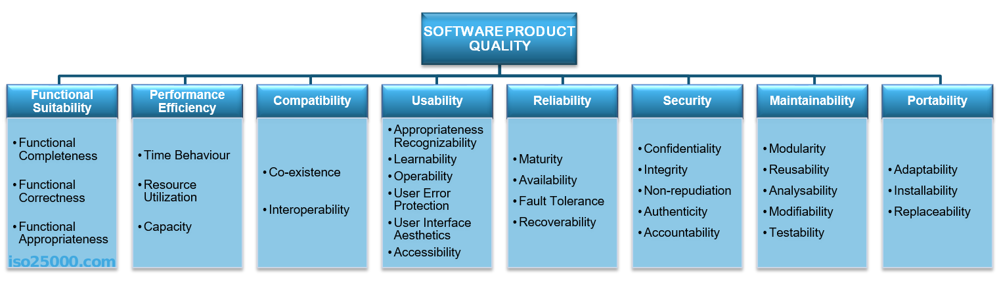
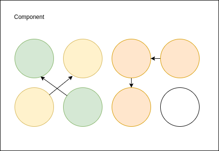
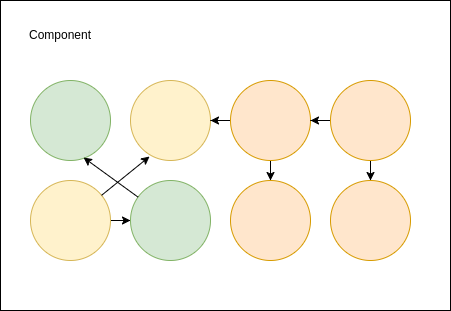
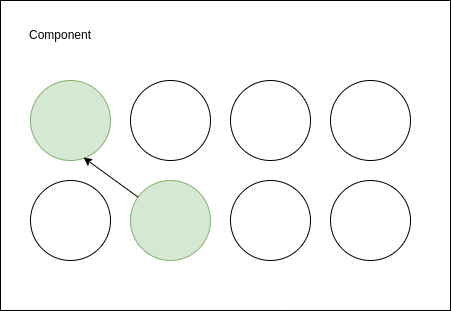
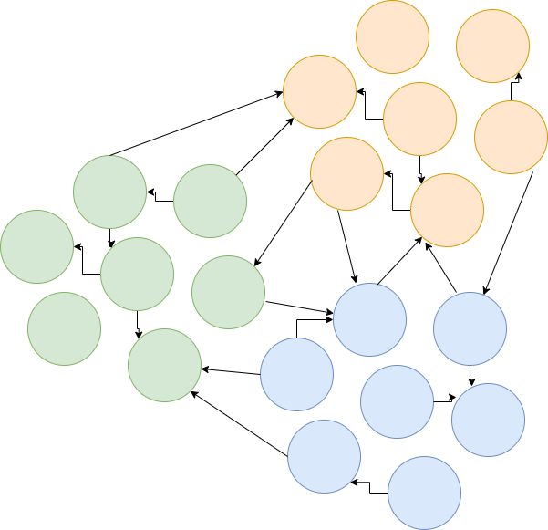
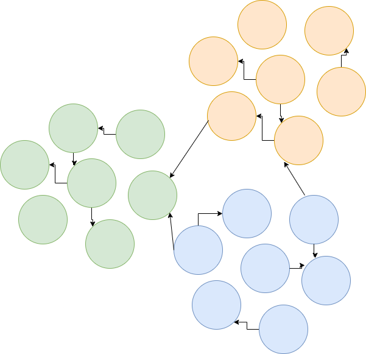
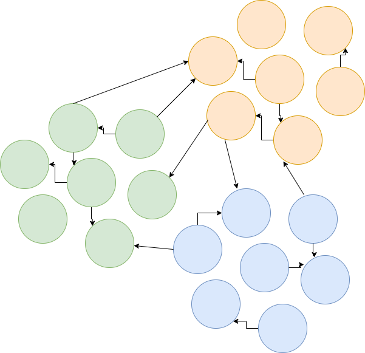
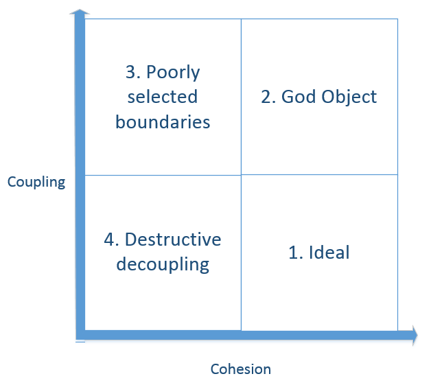
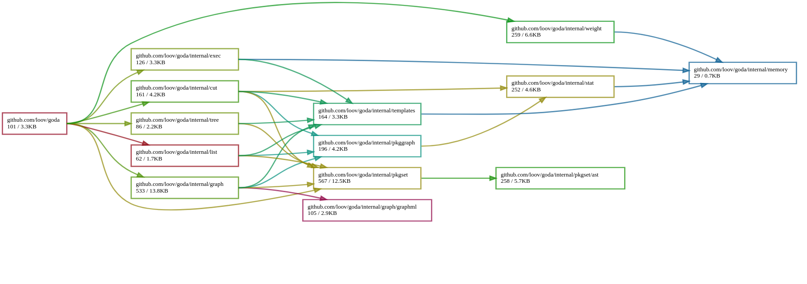

--- title
# Software Architecture 101
## Software Architecture and Software Quality
Nerzal · Juli 2023

--- image
# Motivation

ISO 25010, source: https://iso25000.com/index.php/en/iso-25000-standards/iso-25010

--- blank
# Focus Today
We want to write code that is easily testable. To achieve this, we can make use of some basic principles.

--- content
# Agenda

- Cohesion and Coupling
- Inversion of Control

--- blank
# Cohesion
Definition: Cohesion refers to the degree to which the elements within a module or component are interconnected and aligned with each other.

--- image


--- blank
# High Cohesion
A module with high cohesion performs a specific task and contains only elements relevant to that task. This leads to better understanding, easier maintainability, and facilitates troubleshooting.

--- image


--- blank
# Low Cohesion
When a module fulfills various unrelated tasks, it exhibits low cohesion. This can result in unclear code and difficulties in maintenance.

--- image


--- blank
# Coupling
Definition: Coupling describes the dependencies between different modules or components.

--- image


--- blank
# Loose Coupling
In a system with loose coupling, dependencies between modules are minimal. Changes in one module have minimal impact on other modules, promoting maintainability and flexibility.

--- image


--- blank
# Tight Coupling
Tight coupling occurs when modules are closely interconnected. Changes in one module can have far-reaching effects on other modules, making maintenance challenging.

--- image


--- image
# Cohesion and Coupling

Image from https://enterprisecraftsmanship.com/images/2015/2015-09-02-1.png

--- blank
# Graph your dependencies
For really small projects just use go mod graph. In bigger projects you'll need some sort of graph visualization to help you out.

--- blank
# Goda to the rescue
There are lots of ways to visualize dependency graphs. One of the cooler tools is goda: https://github.com/loov/goda

--- image

Visualization of goda dependencies

--- image
# Goda queries

Visualization of a subset of goda queries

--- blank
# Inversion of Control
IoC promotes a more modular, maintainable, and testable codebase by shifting the responsibility of control and configuration to external entities, typically IoC containers or frameworks.

--- mixed
# Talking about constructors
```go
import (
	"github.com/insane/tobi/sql"
)

type Repository struct {
	dbConnection *sql.DB
}

func NewRepository() *Repository {
	return &Repository{
        dbConnection: sql.NewDBConnection()
    }
}
```

- Coupled through creation dependency
- Coupled to sql package

--- code
# In a Test
```go
package main_test

func TestRepository(t *testing.T) {
	// Arrange
	// ...
	repo := NewRepository()

	// Act
    data, err := repo.Get()

	// Assert
    require.NoError(t, err)
}
```

--- mixed
# Inject Dependency
```go
import (
	"github.com/insane/tobi/sql"
)

type Repository struct {
	dbConnection *sql.DB
}

// Inject dependency
func NewRepository(dbConnection *sql.DB) *Repository {
	return &Repository{
        dbConnection: dbConnection,
    }
}
```

- Coupled to sql package

--- code
# In a Test
```go
package main_test

func TestRepository(t *testing.T) {
	// Arrange
	// ...
	db := sql.NewDBConnection()
	repo := NewRepository(db)

	// Act
    data, err := repo.Get()

	// Assert
    require.NoError(t, err)
}
```

--- mixed
# Resolve external dependencies
```go
type dbConnection interface {
	Get() (*Data, error)
	Save(data Data) error
}

type Repository struct {
	dbConnection dbConnection
}

// Inject dependency
func NewRepository(dbConnection dbConnection) *Repository {
	return &Repository{
        dbConnection: dbConnection,
    }
}
```

- Package is loosely coupled. No hard dependencies.

--- code
# In a Test
```go
package main_test

func TestRepository(t *testing.T) {
	// Arrange
	// ...
	db := mock.NewDBConnection()
	repo := NewRepository(db)

	// Act
    data, err := repo.Get()

	// Assert
    require.NoError(t, err)
}
```

--- image
# Turtles all the way down?


--- blank
Result: Main package is going to have all the dependencies

--- mixed
# Dependency Injection Frameworks

- Self Written
- Ninject (.net), Spring (Java)

What about Go? Simply use interfaces on the receiver side.

--- code
# Applying IoC on a different level
```go
package main

func Foo() {
	data1 := Bar()
	data2 := Baz()

	// Do something with data1 and data2
}

func Foo2(data1, data2 int) {
	// Do something with data1 and data2
}
```
