---
# Software Architecture
## From Requirements to Architecture
Nerzal · July 2021

---
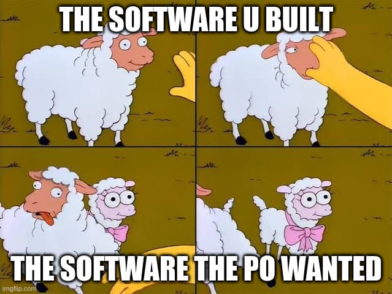
The struggles of product owners

---
# Agenda
- What is architecture?
- Analyzing an existing piece of software
- Cohesion and coupling
- General takeaways

---
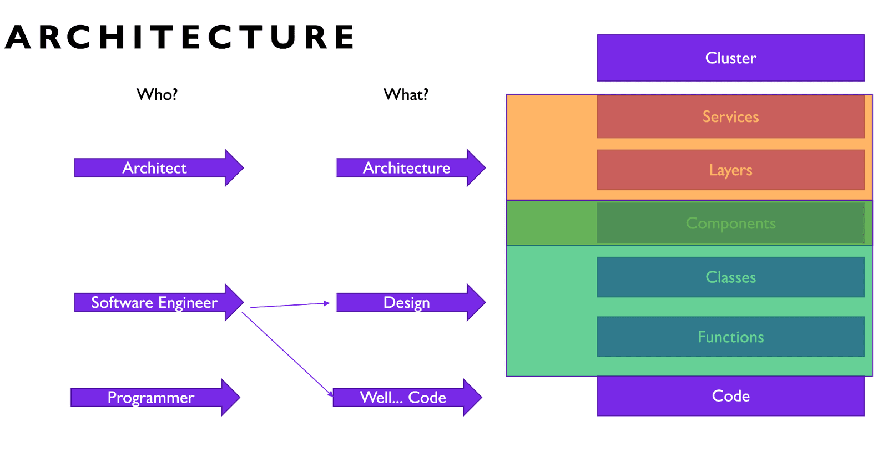
Software architecture vs. design

--- mixed
# It's About the Structure
Possible structures:

- Flat
- Layered
- Layered but modular
- Domain-driven
- Hexagonal

---
# Flat
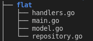
Everything is in one place

---
# Layered
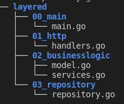
Dependencies only point downwards

---
# Layered but Modular but Broken
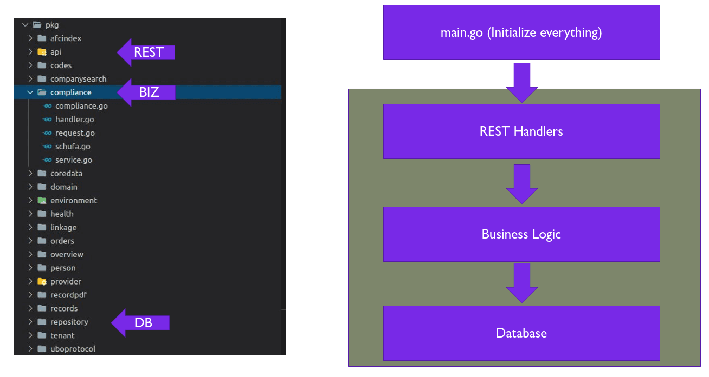
Dependencies only point downwards... and sideways... wait, what?!

---
# What Is the Correct Structure for My Project?

Well... shit.

---
# Analyzing an Existing Piece of Software

---
# ISO 25010

Software Quality ISO — source: iso25000.com

---
# What You Get From Your PO
- Functional requirements

---
# Functional Requirements
- Functional Suitability — the feature is correct and complete
- Usability — we need a color-blind mode
- (Performance Efficiency) — bank account login should not take longer than 3 seconds
- (Reliability) — the app should not crash when an error occurs
- (Security) — we need a login

---
# What Your PO Doesn't Tell You
- Nonfunctional requirements

---
# Nonfunctional Requirements
- Compatibility — ten years from now, the system should be able to expose data to Product X
- Reliability — an order must not get lost when any error happens; the order must remain and the faulty process must be repeated
- Maintainability — modularity: a change to one component should not have a huge impact on other components

---
# Nonfunctional Requirements #2
- Portability — a customer might come up with a server that has no Java; our customers do not have web browsers (wtf?!)
- (Performance Efficiency) — the app should not take more than 64Kb of RAM! (lol)
- (Reliability) — the pods on our cluster should not restart every 5 minutes due to OOM or other reasons
- (Security) — messages sent to the API must be signed

--- mixed
# You Cannot Have It All
- An increase in security might lead to a loss of performance efficiency
- An increase in performance efficiency might lead to a loss of maintainability

So you have to talk with your PO about these effects and find a consensus.

---
# Takeaways
Include your PO early in the process. When talking about requirements, also talk about nonfunctional requirements. Or the other way around: PO, include your developers when working on requirements.

---
# Signs of Bad Architecture / Low-Quality Code
- Even simple features take "long" to implement
- The number of bugs is continuously rising
- Adding something new won't happen without breaking existing things
- Customers quit
- Parts of the software (or the whole thing) "must" be rewritten regularly
- Developers need the search function to find places in the code
- Developers don't want to work on the software
- It is not easy to write tests

---
# Static Code Analysis
To find problems around maintainability, you can use a static code analyzer like SonarQube. Use LoC per function, LoC per file, and cyclomatic complexity as reference values to find worrying places in your code.

---
# Graph Your Dependencies
For really small projects, just use go mod graph. In bigger projects you'll need some sort of graph visualization to help you out.

---
# Goda to the Rescue
There are lots of ways to visualize dependency graphs. One of the cooler tools is goda (https://github.com/loov/goda).

---

Visualization of goda dependencies

---
# Goda Queries
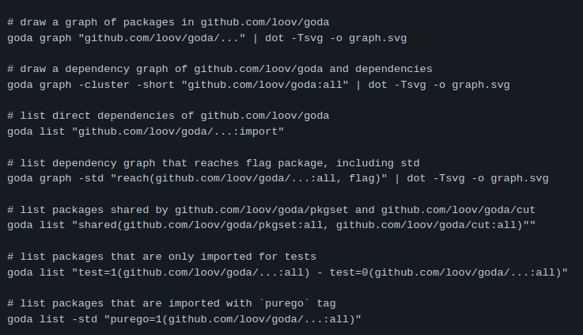
Visualization of a subset of goda queries

---
# Cohesion and Coupling
Goal: strong cohesion and loose coupling.

---
# Bad
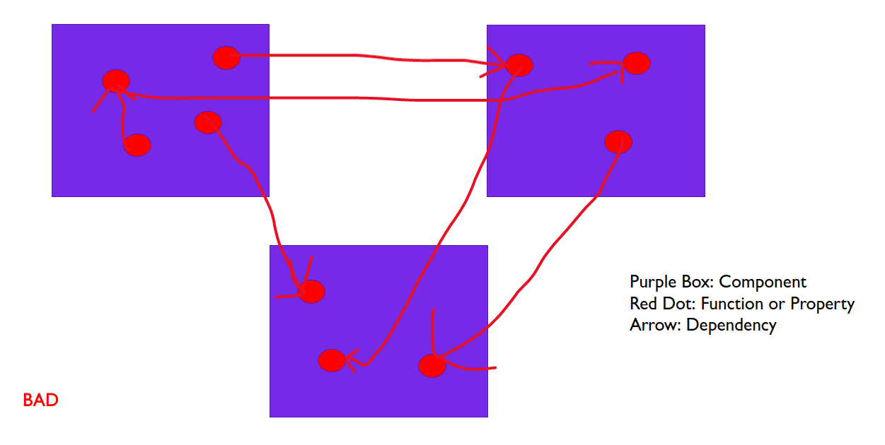
Lots of external dependencies vs. only a few inner dependencies

---
# Good
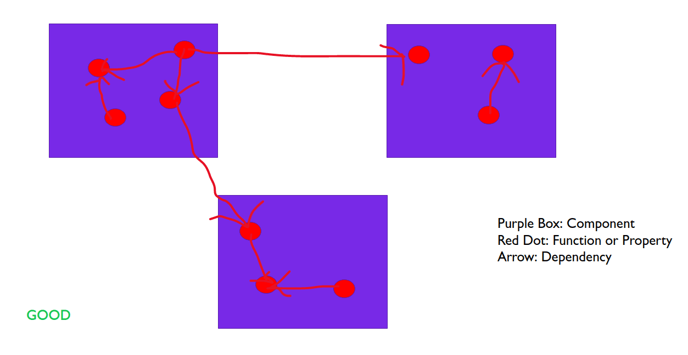
A few external dependencies vs. lots of inner dependencies

---
# The Go Way of Decoupling
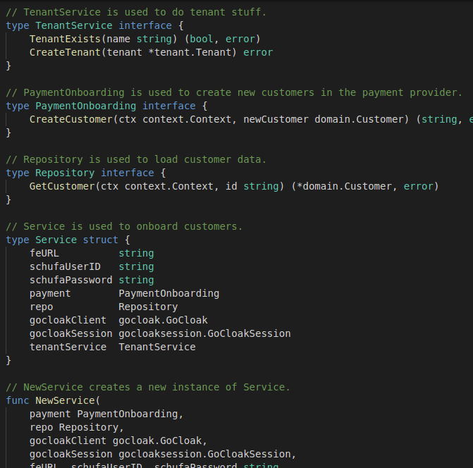
Accept interfaces, return structs

---
# General Takeaways

---
# Don't Do Architecture Alone
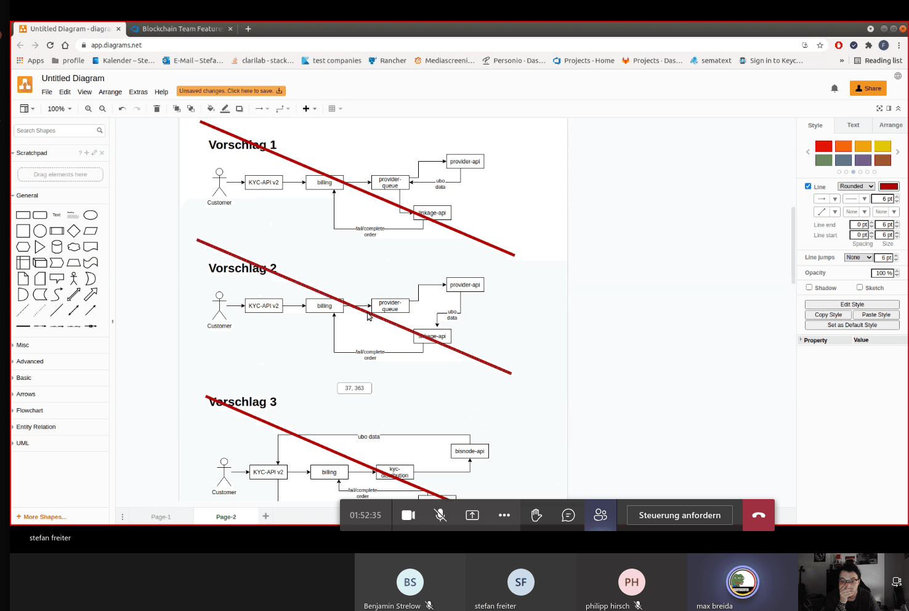
Other people have other points of view — leading to better solutions

---
# Document Your Decisions
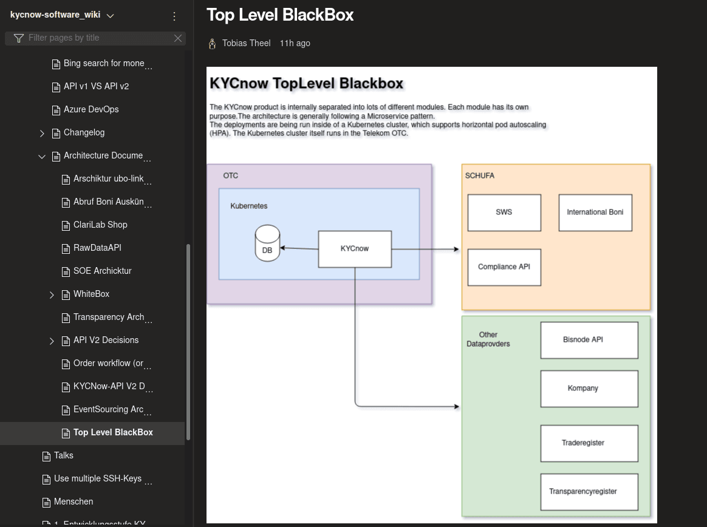
Documenting things helps you later. A new intern joins the team? Easy — show them your architecture diagrams.

---
# Get Your PO Involved
Your PO really knows the domain. So your PO can help you cut your components.

---
# Shit In, Shit Out (SHISHO)
Incomplete and unclear requirements lead to bad, incomplete software architecture. How do you review a pull request for a feature if the requirements aren't even written down?

---
# Stick to One Structural Approach
After starting your project, make sure everyone is aware of the plan and sticks to it. If multiple approaches begin to mix in a single project, you'll end up in a huge mess.

---
# Architecture & Design Before You Start Coding
Think about architecture and design solutions before you start coding. Maybe implement a design step in your process, where you create a design in the form of an image, API documentation, unit/integration tests, or plain text.
