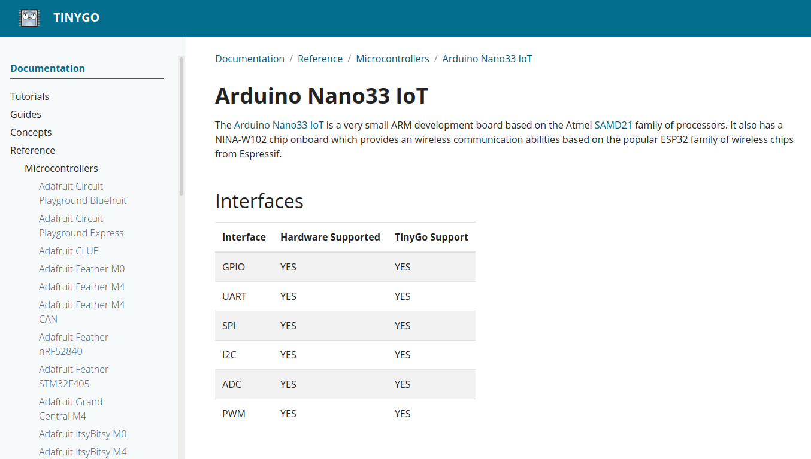
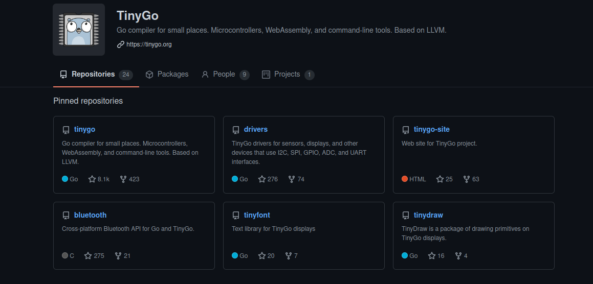

--- title
# Hello TinyGophers
## An introduction to TinyGo and WASM
Nerzal · Februar 2024

--- content
# Agenda
- What is TinyGo?
- Tell me about the features!
- How do you work with interfaces like GPIO, SPI etc?
- WASM

--- content
# What is TinyGo?
- Go for small places (Microcontroller)
- Go for WASM (WebAssembly)
- Go for WASI (WebSystemInterface)
- A new compiler for Go written in Go that makes use of the LLVM compiler toolchain

--- content
# Some numbers
- Currently 85 microcontroller boards are supported, including Arduino Uno, Adafruit Feather M0 and Nintendo Switch (see github.com/tinygo-org/tinygo)
- Currently 101 devices are supported, including the BMP280 temperature/barometer sensor (I2C), the HC-SR04 ultrasonic distance sensor (GPIO) and the ST7735 TFT display (SPI) (see github.com/tinygo-org/drivers)

--- blank
# Demo

--- code
# Code Size
```go
package main

func main() {
	println("Hello World")
}
```

--- content
# Code Size #2
- 0,04 Megabyte when compiled with TinyGo
- 1,21 Megabyte when compiled with Go

--- image

main compiled with Go vs main-tiny compiled with TinyGo

--- mixed
# Code Size #3
WASM
```text
rwxrwxr-x  1 tobias tobias   85261 Feb  9 12:14 tinygo-wasm.wasm
rwxrwxr-x  1 tobias tobias 1408717 Feb  9 12:14 go-wasm.wasm
```
- 0,08 Megabyte when compiled with TinyGo
- 1,40 Megabyte when compiled with Go

--- blank
# Tell me about the features!

--- code
# Language support
```go
package main

import "time"

func main() {
	go func() {
		for {
			println("i'm happily executed by a goroutine")
			time.Sleep(time.Second)
		}
	}()

	select {}
}
```

--- code
# Channels
```go
package main

func main() {
	myChannel := make(chan int)

	go asyncFunction(myChannel)

	for {
		println(<-myChannel)
	}
}

func asyncFunction(myChannel chan int) {
	i := 0
	for {
		myChannel <- i
		i++
	}
}
```

--- content
# So?
- TinyGo supports a big subset of Go, including slices, channels, interfaces, goroutines, defer and garbage collection
- WASM/WASI

--- content
# What is not working?
- Not every Go program can be compiled yet
- Not every function of every Go std package is fully implemented

--- image
# Is my microcontroller (fully) supported?

Screenshot taken from the TinyGo documentation.

--- blank
# How do you work with interfaces like GPIO, SPI etc?

--- mixed
# Blinky
```go
package main

import (
	"machine"
	"time"
)

func main() {
	led := machine.D2
	led.Configure(machine.PinConfig{Mode: machine.PinOutput})

	for {
		led.Low()
		time.Sleep(time.Millisecond * 500)

		led.High()
		time.Sleep(time.Millisecond * 500)
	}
}
```
More info at tinygo.org/docs/tutorials/blinky

--- mixed
# Flashing
Set the target board and pass the path to the main.
```bash
tinygo flash --target=arduino-nano33 code/blinky/main.go
```
Reminder: Don't forget to prove that this is working.

--- image
# The TinyGo Playground

Screenshot of the TinyGo playground. Try it yourself at play.tinygo.org.

--- blank
# Libraries?

--- blank
# Do I have to implement everything on my own?!
No.

--- image
# TinyGo got you covered

Screenshot of TinyGo GitHub repositories.

--- blank
# WASM

--- blank
# What's that?
WebAssembly (abbreviated Wasm) is a binary instruction format for a stack-based virtual machine. Wasm is designed as a portable compilation target for programming languages, enabling deployment on the web for client and server applications. Source: webassembly.org

--- blank
# Why TinyGo?!
The Go compiled binary is 30 times the size of the TinyGo compiled binary!

--- image

Binary size comparison of Go and TinyGo

--- blank
# Demo

--- content
# Interesting files
- index.html
- wasm.js
- wasm_exec.js
- wasm.wasm

--- blank
# index.html
Show in VSCode.

--- blank
# wasm.js
Show in VSCode.

--- mixed
# wasm_exec.js
So called glue code. Implements the syscall/js API.
```javascript
// func sleepTicks(timeout float64)
"runtime.sleepTicks": (timeout) => {
    // Do not sleep, only reactivate scheduler after the given timeout.
    setTimeout(this._inst.exports.go_scheduler, timeout);
},

// func finalizeRef(v ref)
"syscall/js.finalizeRef": (sp) => {
    // Note: TinyGo does not support finalizers so this should never be
    // called.
    console.error('syscall/js.finalizeRef not implemented');
},

// func stringVal(value string) ref
"syscall/js.stringVal": (ret_ptr, value_ptr, value_len) => {
    const s = loadString(value_ptr, value_len);
    storeValue(ret_ptr, s);
},
```

--- mixed
# wasm.wasm
Compiled wasm binary.
```text
(import "env" "syscall/js.valueSet" (func $syscall/js.valueSet (type $t2)))
(import "env" "syscall/js.valueCall" (func $syscall/js.valueCall (type $t6)))
(import "env" "syscall/js.valueInvoke" (func $syscall/js.valueInvoke (type $t7)))
(import "env" "syscall/js.valueLength" (func $syscall/js.valueLength (type $t8)))
(import "env" "syscall/js.valueIndex" (func $syscall/js.valueIndex (type $t5)))
(func $memcpy (type $t8) (param $p0 i32) (param $p1 i32) (param $p2 i32) (result i32)
  (local $l3 i32) (local $l4 i32) (local $l5 i32) (local $l6 i32) (local $l7 i32) (local $l8 i32)
  block $B0
    block $B1
      local.get $p2
      i32.eqz
      br_if $B1
      local.get $p1
      i32.const 3
```

--- code
# wasm.go
```go
package main

import (
	"time"
)

// This calls a JS function from Go.
func main() {
	go func(){
		for {
			println("Hello World!");
			time.Sleep(time.Second)
		}
	}()

	select {}
}

// This function is exported to JavaScript, so can be called using
// exports.add() in JavaScript.
//export add
func add(x, y int) int {
    return x + y
}
```

--- content
# tinydom
- TinyGo compatible DOM manipulation library
- Wraps syscall/js
- Custom types to provide a nice API

--- code
# tinydom example
```go
userInput := input.New(input.TextInput).
SetAutofocus(true).
SetId("username").
SetName("username").
SetAttribute("placeholder", "Username")

passwordInput := input.New(input.PasswordInput).
SetId("password").
SetName("password").
SetAttribute("placeholder", "Password")

submitContainer := doc.CreateElement("div").
SetId("submit-container").
SetClass("submit-container")

loginButton := doc.
CreateElement("button").
SetAttribute("type", "button").
SetInnerHTML("Sign In").
AddEventListener("click", js.FuncOf(s.onLogin))
```

--- image
# tinydom custom types

Screenshot of the implemented custom types. See github.com/Nerzal/tinydom.

--- image
# Vugu

See github.com/vugu/vugu.

--- content
# Get in touch with TinyGo
- Follow @TinyGolang on Twitter
- Join the #tinygo channel on the Gophers Slack (gophers.slack.com)
- Follow twitch.tv/lapipatv, where deadprogram (Ron Evans) hacks on microcontrollers
- Visit tinygo.org, which recently has been completely revamped
