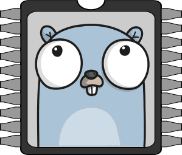
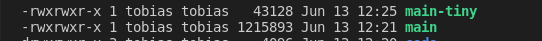
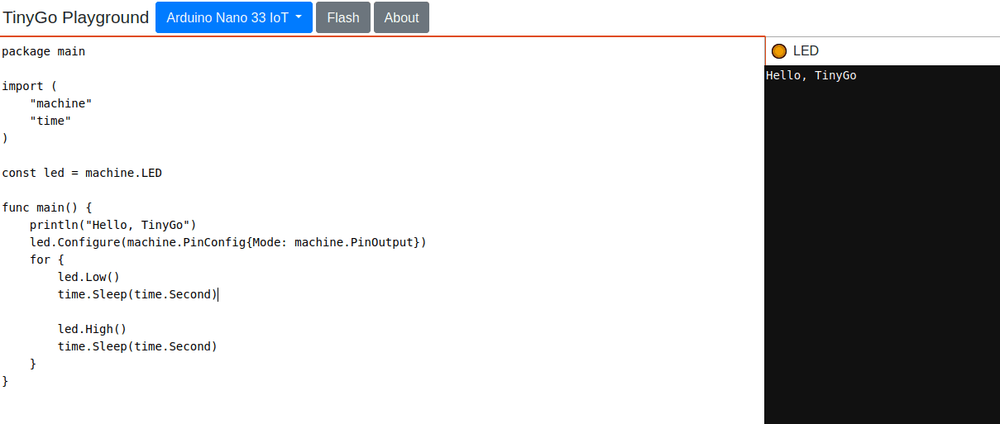
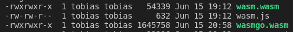
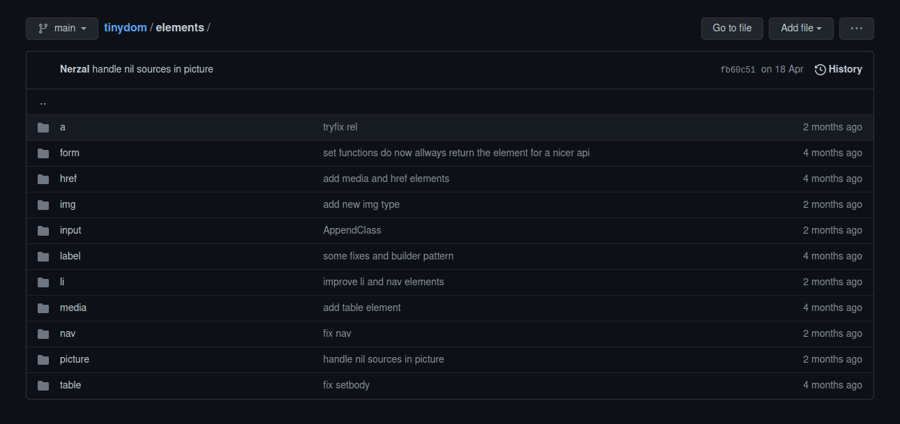
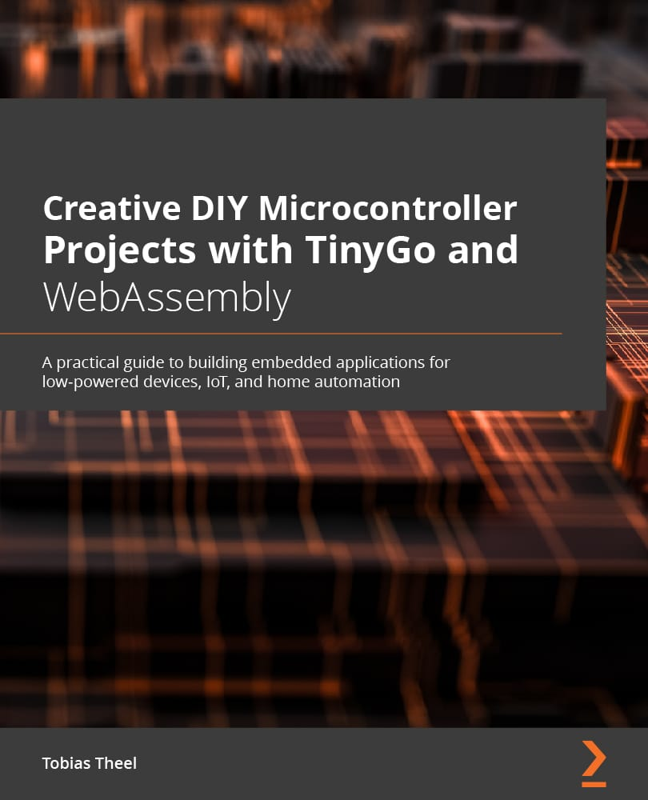

---
# Hello TinyGophers
## An introduction to TinyGo and WASM
Tobias · June 2021

---
# TinyGo
What is it about?! (hint below)

---

TinyGo logo

---
# DemoTime
- Start the server
- Open page in browser
- Showcase
- Don't forget to open the dev tools!
- Oh and please explain some things, while you are at it!

---
# Agenda
- What is TinyGo?
- Tell me about the features!
- How do you work with interfaces like GPIO, SPI etc?
- WASM

---
# What is TinyGo?
- Go for small places (Microcontroller)
- Go for WASM (WebAssembly)
- A new compiler for Go written in Go that makes use of the LLVM compiler toolchain

---
# Some numbers
- Currently 62 microcontroller boards are supported, including the Arduino Uno, the Adafruit Feather M0 and the Nintendo Switch (https://github.com/tinygo-org/tinygo)
- Currently 65 devices are supported, including the BMP280 temperature/barometer sensor (I2C), the HC-SR04 ultrasonic distance sensor (GPIO) and the ST7735 TFT display (SPI) (https://github.com/tinygo-org/drivers)

---
# Code Size
```go
package main

func main() {
	println("Hello World")
}
```

---
# Code Size #2
- 0,04 Megabyte when compiled with TinyGo
- 1,21 Megabyte when compiled with Go

---

main compiled with Go vs main-tiny compiled with TinyGo

---
# Tell me about the features!

---
# Language support
```go
package main

import "time"

func main() {
	go func() {
		for {
			println("i'm happily executed by a goroutine")
			time.Sleep(time.Second)
		}
	}()

	select {}
}
```

---
# Channels
```go
package main

func main() {
	myChannel := make(chan int)

	go asyncFunction(myChannel)

	for {
		println(<-myChannel)
	}
}

func asyncFunction(myChannel chan int) {
	i := 0
	for {
		myChannel <- i
		i++
	}
}
```

---
# So?
- TinyGo supports a big subset of Go, including slices, channels, interfaces, goroutines, defer and garbage collection
- WASM/WASI

---
# What is not working?
- Not every Go program can be compiled yet
- Not every function of every Go std package is fully implemented
- Reflection has been reimplemented
- JSON serialization and deserialization that relies on reflection in general

---

Screenshot taken from the TinyGo documentation

---
# How do you work with interfaces like GPIO, SPI etc?

--- mixed
# Blinky
```go
package main

import (
	"machine"
	"time"
)

func main() {
	led := machine.D4
	led.Configure(machine.PinConfig{Mode: machine.PinOutput})

	for {
		led.Low()
		time.Sleep(time.Millisecond * 500)

		led.High()
		time.Sleep(time.Millisecond * 500)
	}
}
```

https://tinygo.org/docs/tutorials/blinky/

--- mixed
# Flashing
Set the target board and pass the path to the main

```bash
tinygo flash --target=arduino-nano33 tinygo/code/blinky/main.go
```

Reminder: Don't forget to prove that this is working

---
# The TinyGo Playground

Screenshot of the TinyGo playground (https://play.tinygo.org/)

---
# Libraries?

---
# Do I have to implement everything on my own?!
No

---

Screenshot of TinyGo GitHub repositories

---
# WASM

---
# Whats that?
WebAssembly (abbreviated Wasm) is a binary instruction format for a stack-based virtual machine. Wasm is designed as a portable compilation target for programming languages, enabling deployment on the web for client and server applications. (https://webassembly.org/)

---
# Why TinyGo?!

Binary size comparison of Go and TinyGo

---
The Go compiled binary is 30 times the size of the TinyGo compiled binary!

--- mixed
# Home automation dashboard
Goals:
- Control LED strips: turn on/off, change color
- Turn on coffee machine

---
# The server
```go
const dir = "./html"

var fs http.Handler

func main() {
	fs = http.FileServer(http.Dir(dir))
	http.ListenAndServe(":8080", http.HandlerFunc(handleRequest))
}

func handleRequest(resp http.ResponseWriter, req *http.Request) {
	resp.Header().Add("Cache-Control", "no-cache")

	if strings.HasSuffix(req.URL.Path, ".wasm") {
		resp.Header().Set("content-type", "application/wasm")
	}

	if strings.HasSuffix(req.URL.Path, ".css") {
		resp.Header().Set("content-type", "text/css")
	}

	fs.ServeHTTP(resp, req)
}
```

---
# Interesting files
- index.html
- wasm.js
- wasm_exec.js
- wasm.wasm

---
# index.html
```html
<!doctype html>
<html lang=en>

<head>
    <meta charset=utf-8>
    <title>Home Automation Dashboard v0.1</title>
    <link rel="stylesheet" href="styles/general.css">
    <script src="wasm_exec.js" type="text/javascript"></script>
    <script src="wasm.js" type="text/javascript"></script>
    <link rel="preconnect" href="https://fonts.gstatic.com">
    <link href="https://fonts.googleapis.com/css2?family=Zen+Dots&display=swap" rel="stylesheet">
</head>

<body class="background">
    <div id="content">
        <!--content gets replaced dynamically-->
    </div>
</body>

</html>
```

--- mixed
# wasm.js
Initialize the wasm environment

```javascript
function init() {
    const go = new Go();
    if ('instantiateStreaming' in WebAssembly) {
        WebAssembly.instantiateStreaming(fetch(WASM_URL), go.importObject).then(function(obj) {
            wasm = obj.instance;
            go.run(wasm);
        })
    } else {
        fetch(WASM_URL).then(resp =>
            resp.arrayBuffer()
        ).then(bytes =>
            WebAssembly.instantiate(bytes, go.importObject).then(function(obj) {
                wasm = obj.instance;
                go.run(wasm);
            })
        )
    }
}
```

--- mixed
# wasm_exec.js
So called glue code. Implements the syscall/js api

```javascript
// func sleepTicks(timeout float64)
"runtime.sleepTicks": (timeout) => {
    // Do not sleep, only reactivate scheduler after the given timeout.
    setTimeout(this._inst.exports.go_scheduler, timeout);
},

// func finalizeRef(v ref)
"syscall/js.finalizeRef": (sp) => {
    // Note: TinyGo does not support finalizers so this should never be
    // called.
    console.error('syscall/js.finalizeRef not implemented');
},

// func stringVal(value string) ref
"syscall/js.stringVal": (ret_ptr, value_ptr, value_len) => {
    const s = loadString(value_ptr, value_len);
    storeValue(ret_ptr, s);
},
```

--- mixed
# wasm.wasm
Compiled wasm binary

```text
  (import "env" "syscall/js.valueSet" (func $syscall/js.valueSet (type $t2)))
  (import "env" "syscall/js.valueCall" (func $syscall/js.valueCall (type $t6)))
  (import "env" "syscall/js.valueInvoke" (func $syscall/js.valueInvoke (type $t7)))
  (import "env" "syscall/js.valueLength" (func $syscall/js.valueLength (type $t8)))
  (import "env" "syscall/js.valueIndex" (func $syscall/js.valueIndex (type $t5)))
  (func $memcpy (type $t8) (param $p0 i32) (param $p1 i32) (param $p2 i32) (result i32)
    (local $l3 i32) (local $l4 i32) (local $l5 i32) (local $l6 i32) (local $l7 i32) (local $l8 i32)
    block $B0
      block $B1
        local.get $p2
        i32.eqz
        br_if $B1
        local.get $p1
        i32.const 3
```

---
# wasm.go
```go
package main

import (
	"github.com/Nerzal/homeautomation/dashboard/views/dashboard"
	"github.com/Nerzal/homeautomation/dashboard/views/login"
)

func main() {
	dashboardService := dashboard.New()

	loginEvents := make(chan login.Event, 1)
	loginService := login.New(loginEvents)
	loginService.RenderLogin()

	loginEvent := <-loginEvents

	println("New user logged in:", loginEvent.UserName)

	dashboardService.RenderDashboard()
	select {}
}
```

---
# tinydom
- TinyGo compatible DOM manipulation library
- Wraps syscall/js
- Custom types to provide a nice API

---

Screenshot of the implemented custom types (https://github.com/Nerzal/tinydom)

---
# login component
```go
	userInput := input.New(input.TextInput).
		SetAutofocus(true).
		SetId("username").
		SetName("username").
		SetAttribute("placeholder", "Username")

	passwordInput := input.New(input.PasswordInput).
		SetId("password").
		SetName("password").
		SetAttribute("placeholder", "Password")

	submitContainer := doc.CreateElement("div").
		SetId("submit-container").
		SetClass("submit-container")

	loginButton := doc.
		CreateElement("button").
		SetAttribute("type", "button").
		SetInnerHTML("Sign In").
		AddEventListener("click", js.FuncOf(s.onLogin))

	submitContainer.AppendChild(loginButton)

	loginComponent.AppendChildren(header, userInput, passwordInput, submitContainer)
```

---
# click event handler
```go
func (s *Service) onLogin(this js.Value, args []js.Value) interface{} {
	userInput := input.FromElement(s.userInput).Value()
	passwordInput := input.FromElement(s.passwordInput).Value()

	if userInput != userName {
		handleInvalidCredentials()
		return nil
	}

	if passwordInput != password {
		handleInvalidCredentials()
		return nil
	}

	// Goroutine is needed, as blocking operations like this are not allowed inside of async javascript handlers
	// This event handler is called from javascript -> gluecode -> Go
	go func() {
		s.events <- Event{UserName: userInput}
	}()

	return nil
}
```

---
# Vugu

https://github.com/vugu/vugu

--- mixed
# Get in touch with TinyGo
- Follow @TinyGolang on Twitter (https://twitter.com/TinyGolang)
- Join the #tinygo channel on the Gophers Slack (https://gophers.slack.com)
- Follow https://www.twitch.tv/lapipatv, where deadprogram (Ron Evans) hacks on microcontrollers
- Visit https://tinygo.org, which recently has been completely revamped

We are there to help you out :)

---
# I wrote a book <3


---
# What do you learn?
- How to setup TinyGo + IDE
- Basics of microcontroller development
- GPIO/SPI/I2C etc.
- How to write your own drivers
- How to use WiFi and send data over the network
- How to build web apps using WASM

---
# Where can u get it?
Basically at every bookstore. Here is a link to help u out: https://packt.link/a/1800560206

---
# Repositories
- Home automation project (https://github.com/Nerzal/homeautomation)
- My published talks (https://github.com/Nerzal/talks)
- tinydom (https://github.com/Nerzal/tinydom)
- Big thanks to https://test.mosquitto.org/
