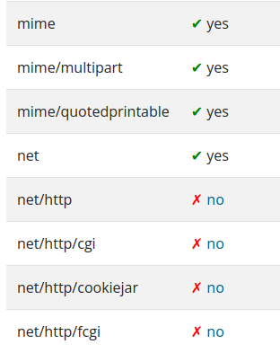
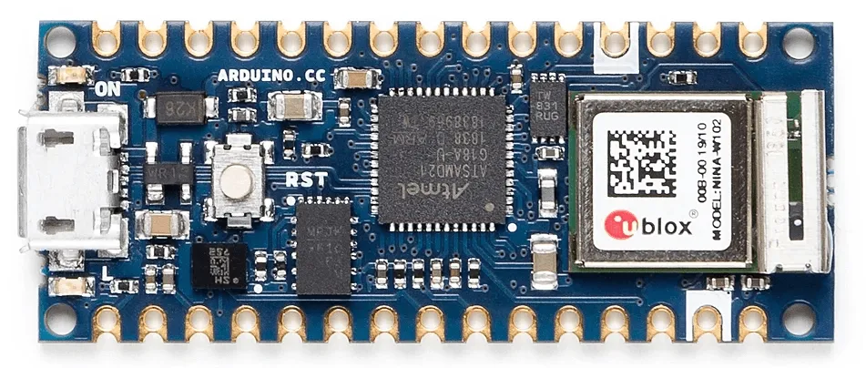
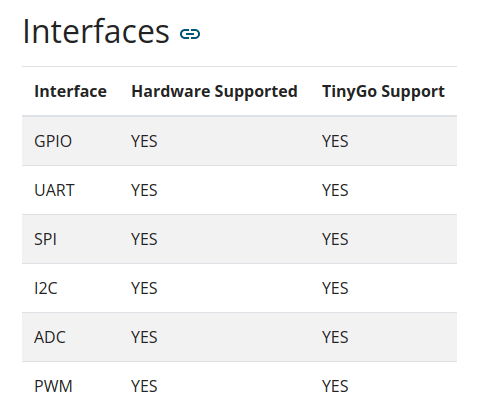
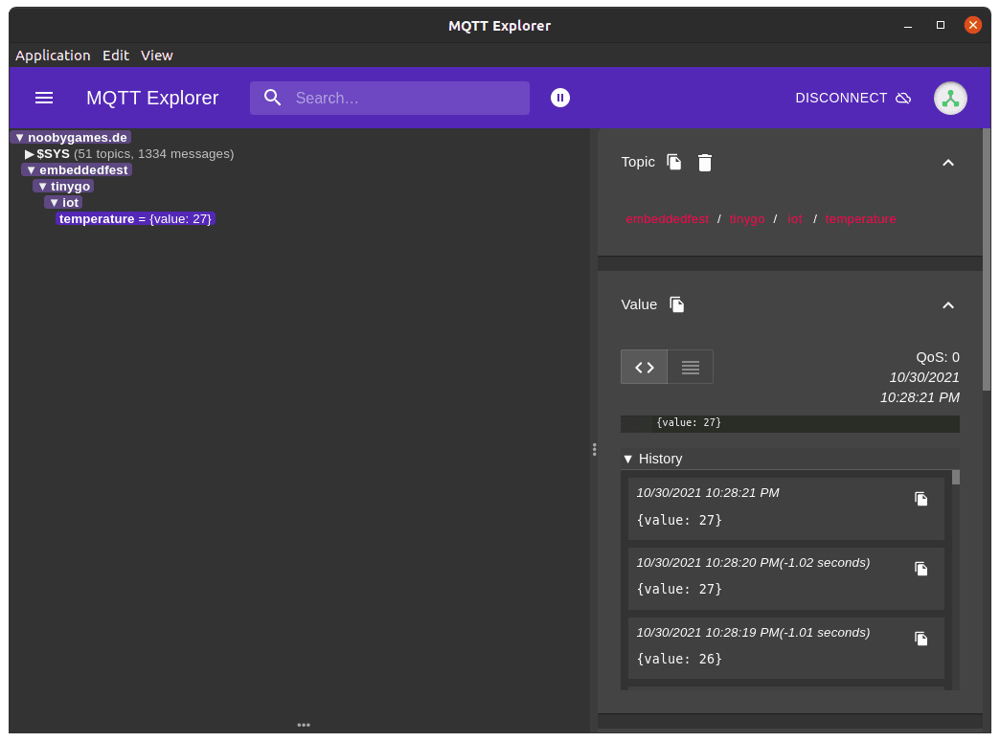

---
# IoT in TinyGo
## An introduction to TinyGo with examples that are based on IoT projects
Tobias · December 2021

---
# Agenda
- What is TinyGo?
- The Arduino Nano 33 IoT
- Setup a WiFi connection
- Send Data over the network
- Livedemo

---
# What is TinyGo?
- A new compiler
- A new implementation of the Go std libraries

---
# New compiler benefits

---
# Hello World
```go
package main

func main() {
	println("Hello World!")
}
```

---
# Comparison
```bash
$ go build -o go-hello code/hello/main.go
-rwxrwxr-x  1 tobias tobias  1157998 Okt 21 20:06 go-hello

$ tinygo build --target=arduino -gc=none -o tinygo-hello.hex code/hello/main.go
-rw-rw-r--  1 tobias tobias     1332 Okt 21 20:07 tinygo-hello.hex
```

---
# New std library benefits
- Packages are optimized for microcontrollers
- The machine package

---
# The machine package
- Implemented per microcontroller board
- Offers constants for pins
- Offers access to all interfaces on a microcontroller board

---
# Downsides
Not everything is implemented yet.

---
# Example

Screenshot from the TinyGo documentation (https://tinygo.org/docs/reference/lang-support/stdlib/)

---
# Summary
- TinyGo executables are really small
- The microcontroller support is integrated into the std libraries
- Some std libraries are not or not completely implemented

---
# The Arduino Nano 33 IoT
Microcontroller: SAMD21 Cortex M0+ 32-bit low power ARM MCU. WiFi Coprocessor: u-blox NINA-W102 (ESP32).

---

Image of the Arduino Nano 33 IoT board

---
# TinyGo support

Image of the Arduino Nano 33 IoT TinyGo support page

---
# Summary
- 3.3V microcontroller board
- Powerful WiFi Coprocessor
- Very good TinyGo support

---
# Setup a WiFi connection

---
# Setup variables
```go
package wifi

import (
	"machine"

	"tinygo.org/x/drivers/wifinina"
)

// access point info
const ssid = "example_wifi"
const pass = "secure1234"

var (
	spi     = machine.NINA_SPI
	adaptor *wifinina.Device
)
```

---
# Initialize interfaces
```go
func setup() {
	spi.Configure(machine.SPIConfig{
		Frequency: 8 * 1e6,
		SDO:       machine.NINA_SDO,
		SDI:       machine.NINA_SDI,
		SCK:       machine.NINA_SCK,
		Mode:      0,
		LSBFirst:  false,
	})

	adaptor = wifinina.New(spi,
		machine.NINA_CS,
		machine.NINA_ACK,
		machine.NINA_GPIO0,
		machine.NINA_RESETN)
	adaptor.Configure()
}
```

---
# Connect to accesspoint
```go
func connectToAP() {
	time.Sleep(2 * time.Second)

	println("Connecting to " + ssid)

	adaptor.SetPassphrase(ssid, pass)

	for st, _ := adaptor.GetConnectionStatus(); st != wifinina.StatusConnected; {
		println("Connection status: " + st.String())
		time.Sleep(1 * time.Second)
		st, _ = adaptor.GetConnectionStatus()
	}

	println("Connected.")
}
```

---
# Summary
- Set SSID and password
- Initialize SPI and WiFi driver
- Trigger the connection attempt using the SetPassphrase function

---
# Setup the MQTT connection
```go
package mqttclient

const server = "tcp://noobygames.de:1883"

func NewClient() mqtt.Client {
	opts := mqtt.NewClientOptions()
	opts.AddBroker(server).SetClientID("tinygo-iot-" + randomString(8))

	client := mqtt.NewClient(opts)

	return client
}

func Connect(client mqtt.Client) error {
	println("Connecting to MQTT...")

	if token := client.Connect(); token.Wait() && token.Error() != nil {
		return token.Error()
	}

	println("successfully connected")
	return nil
}
```

---
# Publish messages
```go
package mqttclient

func PublishMessage(client mqtt.Client, temp int32) {
	message := fmt.Sprintf(`{value: %v}`, temp/1000)
	token := client.Publish("embeddedfest/tinygo/iot/temperature", 1, false, message)
	token.Wait()

	err := token.Error()
	if err != nil {
		switch t := err.(type) {
		case wifinina.Error:
			println(t.Error(), "attempting to reboot..")
			time.Sleep(time.Second)
			arm.SystemReset()
		default:
			println(err.Error())
		}
	}
}
```

---
# Putting all together
```go
package main

func InitializeSensor() lsm6ds3.Device {
	machine.I2C0.Configure(machine.I2CConfig{})
	sensor := lsm6ds3.New(machine.I2C0)
	sensor.Configure(lsm6ds3.Configuration{})
	return sensor
}

func InitializeMQTTClient() mqtt.Client {
	wifi.Setup()
	wifi.ConnectToAP()

	client := mqttclient.NewClient()
	err := mqttclient.Connect(client)
	if err != nil {
		println(err.Error())
		time.Sleep(time.Second)
		arm.SystemReset()
	}

	return client
}
```

---
# The main logic
```go
package main

func main() {
	sensor := InitializeSensor()
	client := InitializeMQTTClient()

	for {
		if !sensor.Connected() {
			println("waiting for temperature sensor")
			continue
		}

		temp, err := sensor.ReadTemperature()
		if err != nil {
			println(err.Error())
		}

		println("sending temperature:", temp/1000, "°C")

		mqttclient.PublishMessage(client, temp)
		time.Sleep(time.Second)
	}
}
```

---
# Livedemo


--- mixed
# Get in touch with TinyGo
- Follow @TinyGolang on Twitter (https://twitter.com/TinyGolang)
- Join the #tinygo channel on the Gophers Slack (https://gophers.slack.com)
- Follow https://www.twitch.tv/lapipatv, where deadprogram (Ron Evans) hacks on microcontrollers
- Visit https://tinygo.org, which recently has been completely revamped

We are there to help you out.

---
# Learning Resources


---
# What do you learn?
- How to setup TinyGo + IDE
- Basics of microcontroller development
- GPIO/SPI/I2C etc.
- How to write your own drivers
- How to use WiFi and send data over the network
- How to build web apps using WASM

---
# Where can u get it?
Basically at every bookstore. Here is a link to help u out: https://packt.link/a/1800560206
