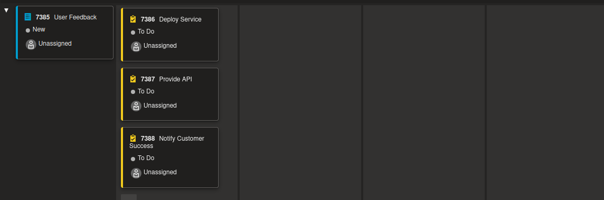
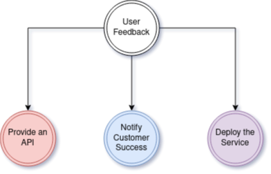
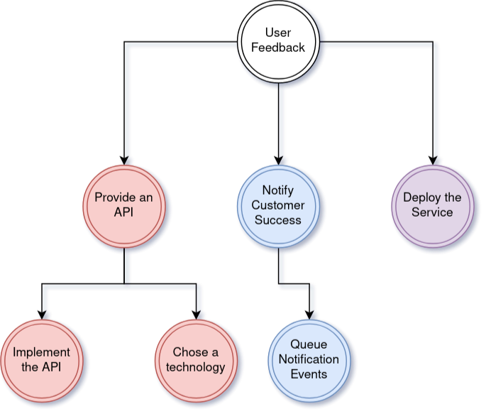
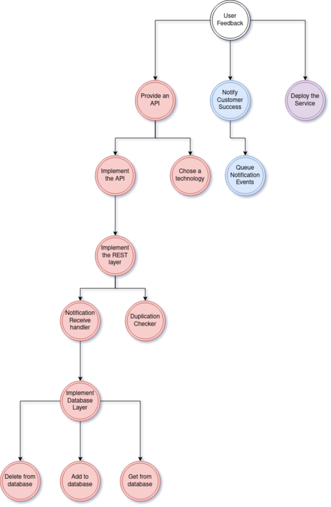
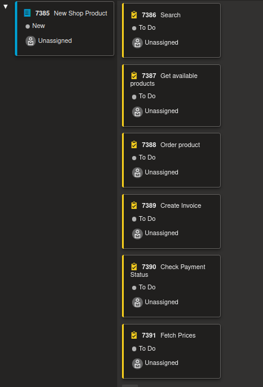
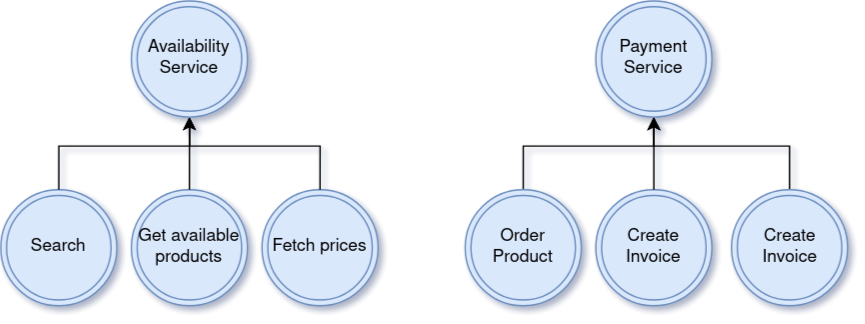
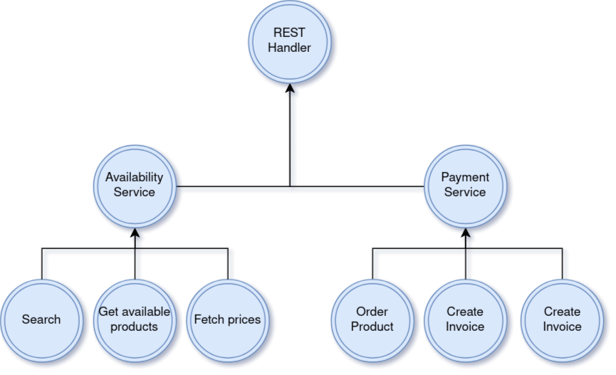

--- title
# Top-Down vs. Bottom-Up
## Different Ways of Approaching a Problem
Tobias · April 2022

--- content
# Agenda
- Top-Down
- Bottom-Up

--- blank
# Top-Down
Your PO jumps into the pit and brings a wild user story: "As a user, I demand to be able to provide feedback using a feedback window." On the user story, there's a small post-it note from your software architect: "Deploy that shit in its own service." So what do you do now?

--- blank
# Creating Tasks
Now you sit in your sprint planning and need to create tasks for that user story.

--- image

Screenshot from Azure DevOps Sprint Board

--- mixed
# What Happened?
As a developer, you have naturally split a bigger problem into several smaller problems.

- Deploy a new service
- Provide an API
- Notify Customer Success

--- blank
# Splitting Problems
You have successfully created three problems out of a single problem! Congratulations, you are now a developer. But what are we going to do now?

--- image

Problem divided into three sub-problems

--- image
# We Create More Problems

Sub-problem divided into even more sub-problems. But what are we going to do now?

--- image
# We Create More Problems

Sub-problem divided into even more sub-problems. But what are we going to do now?

--- mixed
# Top-Down Approach
We continue the process shown in the previous slides until we reach units that cannot be broken down into smaller problems anymore. If your task is to build a new car, you don't start by designing a screw that might be needed somewhere in the motor — you start at a more abstract, top-level approach. You ask questions like:

- How many doors should it have?
- How long should it be?
- What type of motor should it get?

--- content
# Top-Down Summary
- Start with an abstract problem
- Divide that big problem into several smaller and less abstract problems
- Repeat the division until it makes no sense to divide the issues further
- Typical approach in lots of tasks, even ones not dev related

--- blank
# When to Use?
When you have clear requirements and know exactly what comes in, what goes out, and what the environment looks like.

--- blank
# Bottom-Up
Your PO jumps into the pit and brings a wild user story: "As a user, I demand to be able to order that new, different product in your web shop." On the user story, there's a small post-it note from your software architect: "FML, I have no idea how that new data provider works. Good luck, have fun." So what do you do now?

--- blank
# Sprint Planning
You're pretty upset, because you have no information about what the data you need to handle will look like, and neither the architect nor the PO has a vision of the outcome. So you start creating tasks.

--- image

Starting with low-level tickets that describe a part of the functionality

--- mixed
# What Have You Done?
You've created a bunch of tickets that describe lots of smaller problems. All of them need to talk to a foreign API with an unfamiliar specification.

- Search
- Get available products
- Order product
- Create invoice
- Check payment status
- Fetch prices

--- blank
# Implement the Foreign API Endpoints
We start by creating functions that talk to the foreign API. The lowest, or most inner, layers of your application are typically the database layer and the layers that directly talk to third parties.

--- image

Implement the lowest layer of your application first

--- blank
# Find Common Groups / Abstractions
Now that we know what the foreign API expects as input and what comes out of it, we can start to create some abstractions.

--- image

Find common functionality, grouped by business case

--- blank
# Repeat the Process
We repeat the process of finding common groups and abstractions until we reach the highest layer of our application. The highest layer of our example application is the REST handler, which handles REST API requests and then calls the business layer.

--- image

Repeat until we have reached the top layer

--- mixed
# Summary: Bottom-Up
- Start at the smallest, lowest bits
- Find common groups and abstractions
- Repeat until you reach the highest level

Can be helpful when:

- The environment is foreign
- Requirements are bad
- You have a hard time finding top-level abstractions
