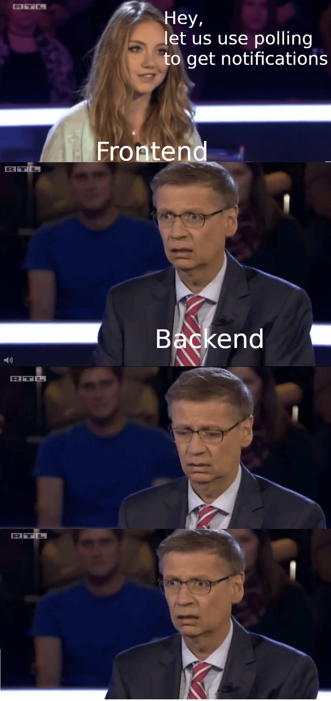
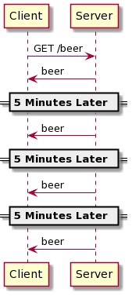
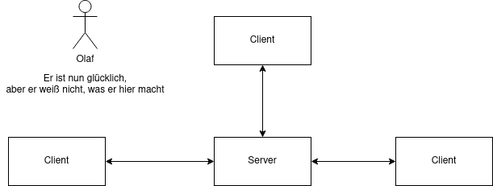
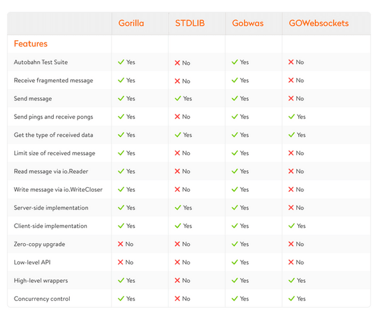

---
# Y u don't know WebSockets?
## Now u know!
Tobias · March 2021

---
# Agenda
- ServerPush
- ServerSentEvents
- WebSockets
- WebSockets in Go
- Real World Examples?

---


---
# ServerPush
- Sometimes we want to push data to clients, without having the client ask for it
- Like: Bro, I have a lit meme, look at it!

---
# Example flow of ServerPush


---
# ServerSentEvents
- Provides ServerPush
- Is based on a long lived HTTP connection
- Max 6 SSE connections per browser per domain
- Browser support is good
- Very efficient, good choice!

---
# WebSockets
- Bidirectional communication
- Event driven communication anyone?
- Connection stays open
- Send a message to 1-N consumers



---
# WebSockets in Go

---
# Libs


---
# Gobwas
- So we use Gobwas: go get github.com/gobwas/ws
- Gobwas seems to be a good choice, as it is very versatile
- We can use very low level connections and directly write on the socket
- Or we use higher level abstractions and make use of JSON n stuff

---
# Listen on TCP and wait for connection
```go
func main() {
	// init
	listener, err := net.Listen("tcp", "127.0.0.1:1337")
	if err != nil {
		println(err.Error())
	}

	conn, err := listener.Accept()
	if err != nil {
		println(err.Error())
	}

	upgrader := ws.Upgrader{}
	if _, err = upgrader.Upgrade(conn); err != nil {
		println(err.Error())
	}
}
```

---
# Handle incoming frames
```go
func receive(conn net.Conn) {
	reader := wsutil.NewReader(conn, ws.StateServerSide)
	// receive message
	for {
		_, err := reader.NextFrame()
		if err != nil {
			// handle error
		}

		data, err := ioutil.ReadAll(reader)
		if err != nil {
			// handle error
		}

		println(string(data))
	}
}
```

---
# Send message
- Write a message to the client
- We can also directly write on the connection

```go
func send(conn net.Conn, message string) {
	msg := "new server message"
	err := wsutil.WriteServerText(conn, []byte(message))
	if err != nil {
		// handle error
	}
}
```

---
# A little less low level
```go
import (
	"net/http"
	"io"

	"github.com/gobwas/ws"
)

func main() {
	http.ListenAndServe(":8080", http.HandlerFunc(handler))
}
```

---
# Upgrade the connection
- Upgrade to WebSocket connection and handle requests

```go
func HandlerFunc(w http.ResponseWriter, r *http.Request) {
	conn, _, _, err := ws.UpgradeHTTP(r, w)
	if err != nil {
		// handle error
	}
	go handleConnection(conn)
}
```

---
# Handling the connection
```go
func handleConnection(conn net.Conn) {
	defer conn.Close()

	state := ws.StateServerSide
	reader := wsutil.NewReader(conn, state)
	writer := wsutil.NewWriter(conn, state, ws.OpText)

	for {
		header, err := reader.NextFrame()
		if err != nil {
			// handle error
		}

		// Reset writer to write frame with right operation code.
		writer.Reset(conn, state, header.OpCode)

		if _, err = io.Copy(writer, reader); err != nil {
			// handle error
		}
		if err = writer.Flush(); err != nil {
			// handle error
		}
	}
}
```

---
# Real World Examples?
- MQTT is capable of handling WebSocket connections
- WebSockets can be used inside WASM
- Social feeds
- Multiplayer games
- Collaborative editing/coding
- Multimedia chats
- Financial tickers
- Sports updates
- Clickstream data
